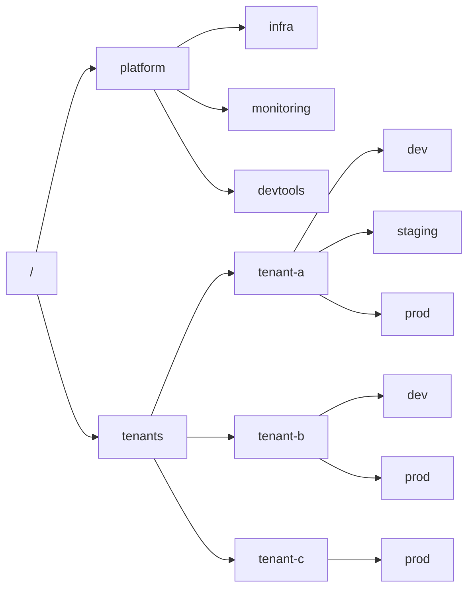

We are excited to introduce **Namespaces** to the OpenBao Secret Manager – a powerful new feature designed to bring robust multi-tenancy and fine-grained isolation to your secrets management workflows.

## What Are Namespaces?

Namespaces in OpenBao are logical partitions within a single OpenBao instance, functioning as isolated environments where teams, organizations, or applications can operate independently. 

Each namespace acts like a mini-OpenBao, with its own policies, authentication methods, secret engines, tokens, and identity groups. This architecture enables organizations to implement a true _OpenBao-as-a-Service_ model, empowering internal customers to self-manage their environments securely and efficiently.

## Why Namespaces?

As organizations scale, the need for strong isolation between teams, business units or tenants becomes critical, especially when handling sensitive data.

Namespaces enable secure multi-tenancy. Each tenant (e.g., team, organisation, or application) operates within its namespace, isolated from others. Permissions are strictly scoped, preventing users from accessing or interfering with resources outside their assigned namespace.

Furthermore, namespaces enable the delegation of administration and promote self-service. Namespace admins can manage their own policies, secret engines, auth modes or even quotas, reducing the burden on cluster-level operators.

Finally, namespaces are one of a few planned stepping stones towards OpenBaos [horizontal scalability](https://openbao.org/blog/vision-for-namespaces/) journey. OpenBao aims to allow support for large, complex deployments with many infrequently accessed mounts, without overloading cluster nodes.

## How to use Namespaces

There are plenty of use cases or multi-tenancy scenarios that namespaces will enable. As an example, let's consider a possible namespace setup for a SaaS Company. The platform team retains a top-level namespace for shared infrastructure. On the other hand, each tenant receives a fully isolated namespace to, e.g., model a staging system.

<figure>

<figcaption>An example namespace structure to separate tenants and the platform team.</figcaption>
</figure>

To use this new feature, no extra setup or configuration is required. The OpenBao CLI now features a special `namespace` sub-command, which can be used to administrate Namespaces.

To recreate the structure of the given example, we would do the following workflow:

1. **Create Namespaces:**

```bash
# creates a namespace "tenant" on root-level
$ bao namespace create tenants
# creates a child-namespace within tenants
$ bao namespace create -ns tenants tenant-c
# creates a child-namespace within tenants/tenants-c
$ bao namespace create -ns tenants/tenant-c prod
```

Note how we use the `-ns` (short form for `-namespace`) flag to create a child-namepace `tenant-c` within the namespace `tenant`. To view status and metadata, we can utilize the `lookup` command:

```bash
$ bao namespace lookup -ns tenants/tenant-c prod
Key                Value
---                -----
custom_metadata    map[]
id                 8QujqL
path               tenants/tenant-c/prod/
tainted            false
uuid               f06d10c7-1300-6c4d-8616-c203b5fdf705
```

Furthermore, we can easily enumerate our hierarchy of namespaces by using the `scan` subcommand. Note that only those namespaces are listed for which the current user token is authorized.

```bash
$ bao namespace scan
Keys
----
tenants/
tenants/tenant-c/
tenants/tenant-c/prod/
```

2. **Create Resources within Namespaces**

Since the introduction of Namespaces, a lot of OpenBao commands became namespace-aware. Similar to our example before, we can add `-namespace` or in short `-ns` to the command.

For demonstration purposes, let's create a KV secrets engine and populate it with a secret.

```bash
$ bao secrets enable -ns=tenants/tenant-c/prod -description="Production Secrets" kv
Success! Enabled the kv secrets engine at: kv/
```

Now that we have created a new kv secrets engine, it will be listed among our default engines:

```bash
$ bao secrets list -ns tenants/tenant-c/prod
Path          Type            Accessor              Description
----          ----            --------              -----------
cubbyhole/    ns_cubbyhole    cubbyhole_9a4e44d3    per-token private secret storage
identity/     ns_identity     identity_61c42408     identity store
kv/           kv              kv_b993bbec           Production Secrets
sys/          ns_system       system_ba514ba2       system endpoints used for control, policy and debugging
```

Let's read and write a secret...

```bash
# Create the secret within namespace
$ bao kv put -namespace=tenants/tenant-c/prod -mount=kv auth-token foo=bar
Success! Data written to: kv/auth-token

# Read it
$ bao kv get -namespace=tenants/tenant-c/prod -mount=kv auth-token
=== Data ===
Key    Value
---    -----
foo    bar
```

3. **Lifecycle Operations**

Over time, tenants will inevitably require various changes and customizations to their namespaces. Moving the administration away from the OpenBao operators means that those changes can be performed on demand and individually by the tenant operator. Consequently, we implemented the associated (and probably expected) lifecycle features such as

* Namespace-aware policies and quotas
* Moving or renaming secret or auth engines across namespaces
* Locking and unlocking of namespaces

While we have a lot of plans on how to extend namespace capabilities in the future to make them even more helpful, we still maintain API compatibility with Vault Enterprise to enable a smooth migration path.

## Looking Ahead: Horizontal Scalability

Namespaces will give organisations the possibility to better structure and isolate secret information. However, the introduction of namespaces is just the first step. Our vision includes supporting _lazy loading_ of namespaces and mounts, allowing OpenBao clusters to efficiently serve workloads with many infrequently accessed resources. This will enable even greater scalability and resilience, as nodes will no longer need to load the entire system state at once. 

[Here](https://openbao.org/blog/vision-for-namespaces/) is another article if you want to read more about OpenBaos' scalability efforts. Sounds interesting? Join the [WG-Horizontal-Scalability](https://lists.lfedge.org/g/openbao-dev-wg-scalability) if you want to help building! 

## Get Started

We are planning to release OpenBao 2.3 Beta in the upcoming days. We invite you to explore the documentation, try out the new features, and share your feedback as we continue to evolve OpenBao for secure, scalable, and self-service secrets management.
