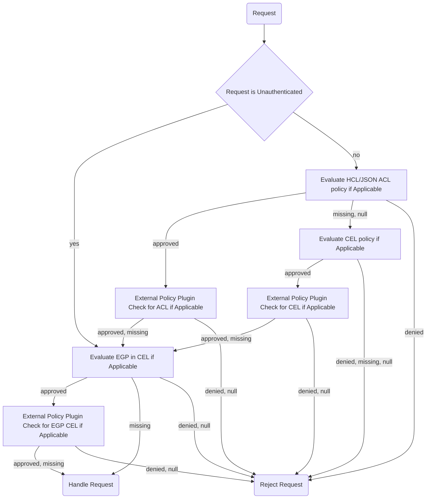

# CEL for Policies

## Summary

Having a built-in policy engine in a more expressive language than the native
HCL/JSON based ACL policy engine is quickly becoming important for OpenBao,
especially given the complexity of recent CVEs. Certain policy decisions just
fundamentally are not expressible in the existing constructs. This proposes
introducing CEL as a policy language while mirroring most of HashiCorp's
definitions of Endpoint Governing Policies (EGP) and Role Governing Policies
(RGP).

## Problem Statement

Mirroring this proposal is the introduction of supplement, [external
authorization](https://github.com/openbao/openbao/pull/4003). This is meant
to be a complimentary proposal, providing additional hooks to call external
authorization engines.

Operators need alternatives to HCL/JSON policies. The parameter restrictions
(`allowed_parameters`, `denied_parameters`, and `required_parameters`) are
not sufficiently expressive enough to capture wildcards, regexes, and even
widely-used framework types like `TypeCommaIntSlice`, `TypeCommaStringSlice`,
and `TypeMap`.

As `Metadata` or `InternalMetadata` are expanded, operators could see the
need to have more rich templating capabilities than what the existing
identity templating provides.

Lastly, existing policy semantics are rather unclear as documented in issues
like [openbao#514](https://github.com/openbao/openbao/issues/514) and several
bogus CVE reports around deny semantics. Expressing a cleaner hierarchy or
inheritance of policies allows operators to have greater confidence in the
rules they write.

Fortunately (or unfortunately), OpenBao has a hammer: [CEL](cel-best-practices.mdx).

## User-facing Description

### Evaluation Precedence

Vault Enterprise supports two types of policies: HCL/JSON ACL policies and
Sentinel based policies either attached to tokens (like ACL policies, called
RGPs) or protecting endpoints regardless of token permissions (like a builtin
WAF, called EGP).

Notably, policy evaluation at a broad level are a function:

```
EvalPolicy(req *logical.Request) --> (state: Allow, Deny, Unknown)
```

Any type of policy may either explicitly allow a request, explicitly deny a
request, or have no opinion. If at the end of processing (in whatever
precedence) order, the result is still `Unknown`, OpenBao executes a default
deny policy.

Due to the perceived speed and precedence of ACL policies, these will always
be evaluated first. Then any token-specific RGPs will be evaluated, and
finally any EGPs. At each stage (ACL, RGP, and EGP), an tentatively-approving
policy can defer to an external policy engine. One no is sufficient to fatally
reject the request, though a yes from ACL or RGP is still gated by EGP. For
unauthenticated requests, we'll still allow operators to specify EGP.

In addition to the above policy evaluation states, a policy may not exist at
the specified level, e.g., refer to a name which is not registered or have an
empty `token_policies`. This means each policy evaluation box is of degree
four (minus shared behaviors).

Overall, this yields a control flow diagram like the following:



### Endpoints

Like Vault Enterprise, policy names will be global unique such that an ACL
policy and an RGP policy cannot share the same name, thus removing
ambiguity. We'll introduce OpenBao-specific endpoint names (`cel-egp` and
`cel-rgp`) under `sys/policies/<type>/<name>`).

We'll also introduce a new `sys/policies/debug` endpoint, wherein collections
of policies can be evaluated against a specified request context to identify
problems. This will be a highly privileged endpoint, though won't have side
effects. Output format for this endpoint is subject to change.

## Technical Description

CEL as a program is already well understood as it is widely used within
OpenBao: for roles in JWT and PKI, soon Cert Auth, and in the profile system.
We'll continue following the best practices set forth elsewhere. Into this
context we'll inject an additional method to call

Most of the changes will happen to policy evaluation within
`performPolicyChecks(...)`. We'll have to expand the existing implementation
of `acl.AllowOperation(...)` to define whether the `Allowed=false` status is
due to an explicit rejection or because of a default-deny policy. Then we'll
add parallel RGP evaluation and unconditionally execute EGP if defined for
the endpoint.

From a technical standpoint, the three-state can be effectively communicated
in Go 1.27 with the `*bool` semantics, assigning either `new(true)` or
`new(false)` for explicit accept or reject respectively.

This will look something like:

```go
func (c *Core) performPolicyChecks(...) {
  state = unknown

  if acl != nil && !opts.Unauthed && state == unknown {
    ... check ACLs ...

    if acl.rejected {
      return no
    } else if acl.allowed {
      state = approved
    }
  }

  if rgp != nil && !opts.Unauthed && state == unknown {
    ... check RGP ...

    if rgp.rejected {
      return no
    } else if rgp.allowed {
      state = approved
    }
  }

  if !opts.Unauthed && state != approved {
    return no
  }

  if egp != nil {
    ... check EGP ...
    if egp.rejected {
      return no
    }
  }

  return yes
}
```

### Debug mode

For ACL, the tracing capabilities will need to be expanded to return more
verbose information regarding policy decisions.

For CEL policies, debug mode should record the values of all variables and
expressions, allowing for easy debugging of results if the program author
writes simple expressions.

For external policies, the decision should be sufficient.

## Rationale and Alternatives

An alternative is to push CEL into the external authorization engine as a
plugin type. However, this will likely result in authors writing simple
rules like:

```path "*" {
   capabilities = ["ask"]
}
```

However, its not immediately clear how complex sets of CEL policy would be
expressed here (if it were builtin) and EGP would not work effectively.

Given the benefits of EGP applying to unauthenticated paths (whereas even
with a token, ACL policies are not evaluated on unauthenticated paths),
there's no effective way to restrict this.

## Downsides

 - This does introduce more complexity alongside external auth engines.

## Security Implications

This adds additional attack surface and complexity in authorization decisions
but balances it (for better or worse) with a more expressive language. While
allowing the policy author more opportunity to potentially mess up, we can
easily expose debug operations and give the policy author finer control over
validating parameters that we'd likely never be able to do in HCL/JSON based
ACL policies without introducing CEL there.

## User/Developer Experience

 - Operators will have far greater control over authorization decisions.

## Unresolved Questions

n/a

## Related Issues

- https://github.com/openbao/openbao/issues/514
- https://github.com/orgs/openbao/discussions/783
- https://linuxfoundation.zulipchat.com/#narrow/channel/529890-openssf-openbao-discussion/topic/RFC.20reviews/near/614757304

## Proof of Concept

n/a
