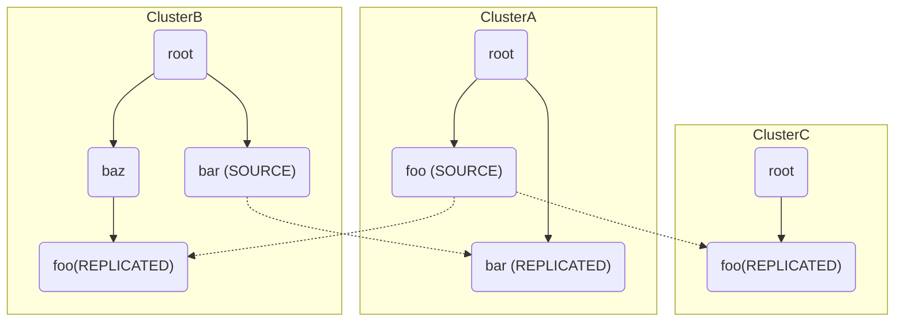
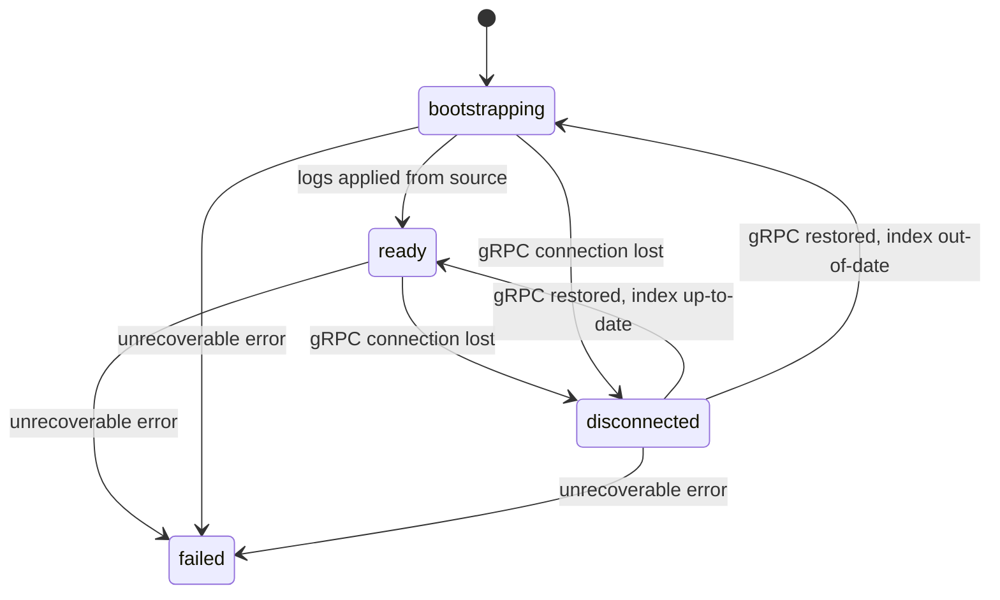
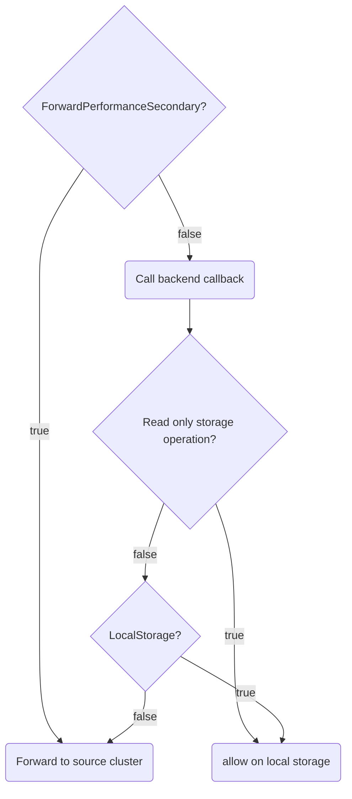
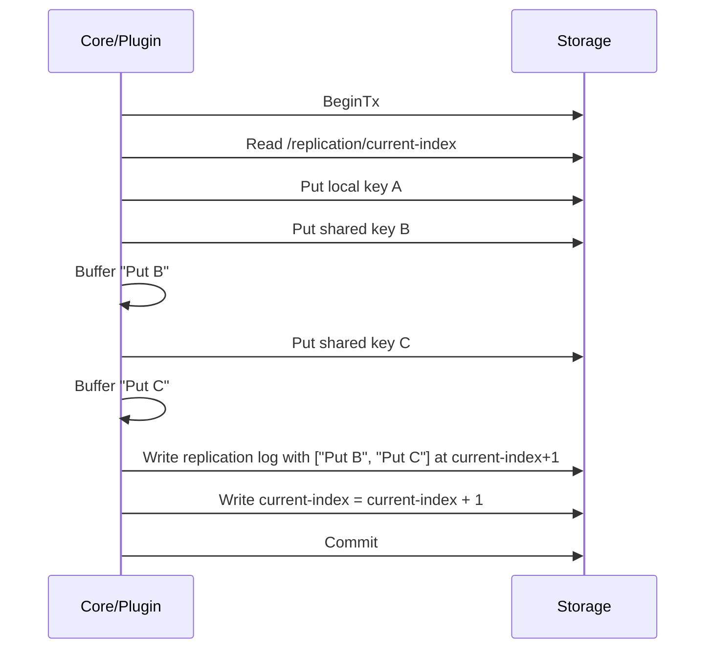
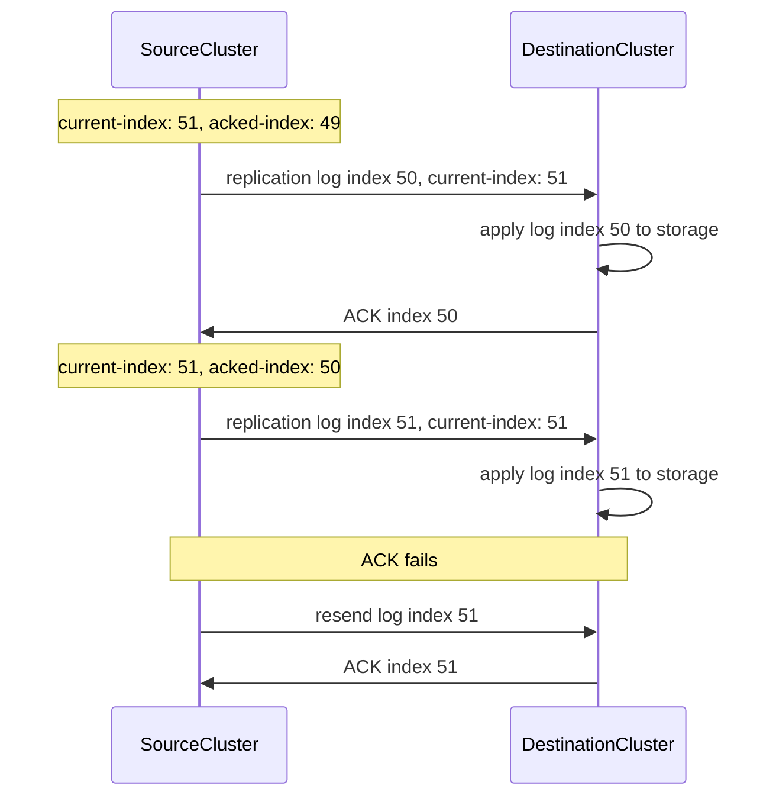
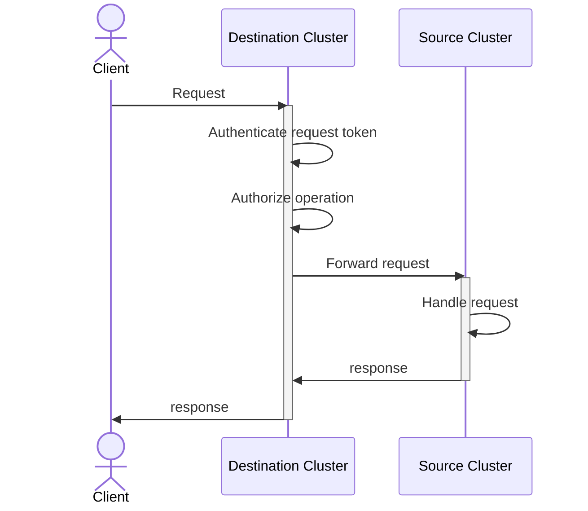

# Namespace Replication

## Summary
This RFC proposes a mechanism to allow OpenBao to replicate namespaces across
multiple clusters deployed in separate availability zones with the aim of
improving read locality in the destination namespaces.

The operator chooses which namespace to replicate from a source cluster (which
owns the original namespace) to a destination cluster. The destination namespace,
from the perspective of the user, is then "mounted" on a selected parent
namespace on the destination cluster.



This allows the operator to set up a multi-cluster OpenBao deployment with
distributed namespace ownership. This carries some advantages, for example, the
namespace can be owned by the cluster/region where the most write traffic is
expected.

Once replication is set up:
* Replication is performed via replication logs sent asynchronously by the
  source cluster to the destination clusters. The consistency model is eventual
  consistency.
* Requests that do not result in a shared state mutation are handled directly by
  the destination clusters.
* Other requests are forwarded to the source cluster to be handled.
* The destination namespace maintains its own leases/tokens.

Implementation can be divided into 2 phases:
* In the first phase, requests that would have been forwarded to the source 
  cluster are rejected by the destination cluster. Within this phase: 
  * Shared replicated data is read-only on destination namespaces.
  * Local storage data can be mutated locally by the destination namespace.
* In the second phase, request forwarding is implemented, allowing clients 
  to mutate shared replicated data by sending requests to destination clusters.

Replication is only supported for transactional storage backends.

This RFC discusses mainly the ideas and mechanisms, leaving detailed
specifications like API and gRPC definition open.

## Problem Statement
Large enterprise OpenBao users may have the need to make secrets/engines on
OpenBao available in multiple data centers to allow better read
locality/performance for clients scattered across multiple geographical regions.

While OpenBao is already making significant improvements in [horizontal
scalability](https://openbao.org/blog/improved-horizontal-scalability/), most of
the support today is restricted to a single-cluster architecture.

An operator could enable
[read-replication](https://openbao.org/community/rfcs/standby-nodes-handle-read-requests/)
in a stretched cluster across multiple data centers, having voter nodes in one
data center and non-voters in the others. With this, improved read locality in
the non-voting data center can be achieved. However, this has a number of
disadvantages:

* No selective replication is possible, since all the nodes belong to the same
  cluster and all storage is replicated. This leads to complete exposure of the
  data in all locations, which might not be desired.
* All write requests need to go through the single leader node in the cluster,
  incurring WAN round trip times.
* The voter nodes in the source location becomes the single point of failure:
  when that data center is unavailable, the non-voters cannot automatically vote
  for a new leader.

There are RFCs for [Namespace
Federation](https://github.com/openbao/openbao/issues/1568) and [Namespace
Transfer](https://github.com/openbao/openbao/issues/1569) which work towards a
multi-cluster architecture, using namespaces as the level of segmentation for
cross-cluster communication. However, they do not yet address the use case of
replication. It's useful to think of the boundaries of these 3 proposals as:
* [Namespace Federation](https://github.com/openbao/openbao/issues/1568) allows
  a namespace to be available on another cluster, but forward all requests. This
  doesn't improve read locality on other clusters since all requests are
  forwarded to the source cluster.
* [Namespace Transfer](https://github.com/openbao/openbao/issues/1569) allows
  transfer of namespace ownership from one cluster to another cluster. Without
  further mechanisms like Federation or Replication, the namespace remains
  available only the cluster that owns it.
* Namespace Replication, as proposed in this RFC, allows the namespace to be
  continously replicated to other clusters, which maintain a local copy and can
  handle some local operations, improving read locality in destination clusters.

## User-facing Description
### Cross-cluster namespace link establishment
The users should be able to establish communication between two clusters, while
selecting the namespace to be replicated.

The two-step process proposed in [Namespace
Federation](https://github.com/openbao/openbao/issues/1568) already sets this up
nicely:

> Operators can create federated namespaces via a two-step process:
> * On the source cluster, calling `sys/namespaces/:path/federate/links/:name`, which
> yields federation credentials. 
> * On the destination cluster, calling `sys/namespaces/:path/federate/link`, which 
> creates a new reference to the  federated namespace on this cluster.
>
> From here, credentials are exchanged between the two clusters (a long-lived
> certificate issuing token allowing the destination cluster to request a
> certificate used for subsequent GRPC calls). The namespace can be unlinked via
> a call to `DELETE sys/namespaces/:path/federate/link` on the destination cluster
> or by listing linked clusters on the source cluster (via
> `sys/namespaces/:path/federate/links`) and deleting the relevant entry (at
> `sys/namespaces/:path/federate/links/:name`).

The process above can be extended to a generic "link" operation at endpoints
`sys/namespaces/:path/links/:name` (on source) and `sys/namespaces/:path/link`
(on destination), that can support either federation or replication based on a
`type` parameter (which is either `federate` or `replicate`).

The call to `sys/namespaces/:path/link` on the destination cluster actually
produces the namespace, and thus contains in the body information normally
required in the [create
namespace](https://openbao.org/docs/api/system/namespaces/#create-namespace)
endpoint, including `custom_metadata` and `seal`. This also means that the
destination namespace maintains its own seal rather than inherit the same seal
configuration from the source namespace.

Once replication is successully set up, the namespace appears on the destination
cluster and behaves like a normal namespace, barring access from parent
namespace (similar to Namespace Federation).

Child namespaces belonging to a source namespace are not replicated to the
destination cluster.

Destination namespace has the same UUID as that of the source namespace.

### Destination namespace lifecycle
After a successful link, the destination namespace appears immediately on the
destination cluster. If a seal is configured, the namespace needs to be unsealed
before replication can take place.

Once the namespace is ready for replication, it needs some time to receive
sufficient data from the source in order to catch up to the state of the source
namespace. To make this visible to the user, a new optional `replicated_state`
response field is added to the namespace object in namespace API requests. `replicated_state` is
only available on destination namespaces and can be:
* `bootstrapping`: after successfully linked and unsealed, the namespace is
  receiving an initial log to catch up to the source namespace. This state
  is also used when the namespaces needs more incremental updates through a
  synchronization index after replication is paused and resumed. Requests are
  rejected in this state.
* `ready`: the namespace has received and applied the initial log along
  with all updates through its synchronization index sent by the source and can
  now service requests.
* `failed`: permanent failure with the link/sync process (invalid credentials,
  incompatible version etc...), requests are rejected.
* `disconnected`: the namespace lost connection to the source. Requests are
  rejected (after a pre-configured grace period if transitioned from `ready`).
  Requests that would normally be forwarded to the source cluster are always
  rejected.

If a destination namespace is successfully unlinked, it is not visible on the
destination cluster anymore.

When a destination namespace is sealed, replication is paused and
`replicated_state` is saved. After the namespace is unsealed, OpenBao checks the
replication index for possible updates and transitions the state accordingly.
The same mechanism applies for when the destination cluster has a leader change
or is restarted.



### Request handling
On destination namespaces, requests that modifies a shared replicated state or
can result in external side effects specific to the source cluster get forwarded
to the source cluster to be handled, while other requests are handled locally on
the destination cluster. It is therefore important to classify what is
replicated and what can be considered local-only. This is discussed in the
technical description.


## Technical Description
### Replicated data and request forwarding decision

The table below shows some example data types that should be replicated and data
that is considered local:

| State       | Example data                                                        |
| ----------- | --------------------------------------------------------------------|
| Replicated  | auth and secret mount configuration, policies, kv/transit/pki keys. |
| Local       | token, leases, pki issued leaf certificates, revocations, CRLs...   |

In the logical backend contract, there are already some important options that
allows OpenBao to decide which request to forward and which not. These are the
[ForwardPerformanceSecondary](https://github.com/openbao/openbao/blob/19ed1503f38542430449248ab464df8a9a5c3424/sdk/framework/path.go#L206-L208)
and
[LocalStorage](https://github.com/openbao/openbao/blob/19ed1503f38542430449248ab464df8a9a5c3424/sdk/logical/logical.go#L128-L131)
flags.

The `LocalStorage` flag denotes the paths within a logical backend's storage
data that should be considered local to the cluster and thus should not be
replicated. With the information provided by this flag, we can already define
the types of replicated data within the namespace as:
* logical (auth and secret) mount configurations
* policies
* any data under the storage of the logical engine mounts that are not listed
  under `LocalStorage`

and these data are not replicated:
* tokens
* leases
* any data listed under `LocalStorage`

This maps nicely to the table of example data, for instance:
* In PKI, `certs/` is listed in `LocalStorage`, meaning issued certs are local
  to a cluster. Root/intermediate CA materials and key stored in the mount are
  replicated.
* KV doesn't have any path in `LocalStorage`, meaning all secrets are replicated.

On a replicated destination namespace, requests that result in write operations
to storage paths not listed under `LocalStorage` must be forwarded to the source
cluster.

`ForwardPerformanceSecondary` denotes operations that should be forwarded to the
source cluster. Operations with this set to `true` must be forwarded to the
source cluster even before the engine callback is executed. This is useful in
case the callback potentially mutates external resource before invoking the
storage operations in OpenBao. An example of this is the database [rotate
root](https://github.com/openbao/openbao/blob/1859768bdb897d92723c68f8457128c9fd707a98/internal/builtin/logical/database/path_rotate_credentials.go#L21-L47)
operation, where the root user on the database may be mutated.

Combining `ForwardPerformanceSecondary` and `LocalStorage`, we can have this
following request forwarding logic on a replicated destination namespace:


### Storage changes
Since source and destination namespaces can have different seal configurations
and thus potentially different root keys, replication logs cannot directly rely
on the storage backend's (e.g, Raft's) WAL, a log system based on the logical
layer would be needed. This would also allow replication to work independently
of storage backends, provided that the backend supports transactions.

On the source cluster, this storage layout is used to store replication logs
```
/replication/<namespace-id>
    current-index
    logs/<index>
    destination/<link-name>/acked-index
```
* `namespace-id` is the UUID of the source and destination namespace.
* `index` is an integer that counts up for every new log.
* `logs/<index>` contains the actual replication log at that index, which has 
  one or more storage effects on the logical layer (for example, `[PUT /some/path, DELETE /some/other/path]`)
* `destination/<link-name>/acked-index` is the replication index acknowledged by one 
  destination namespace.
* `link-name` is the link name specified in the call to `sys/namespaces/:path/links/:name` on the source namespace.

and on the destination cluster:
```
/replication/<namespace-id>
    link-name
    current-index
```

Since replication logs can contains secrets, anything under
`/replication/<namespace-id>` must be stored behind the namespace's barrier.

Whenever there is a logical write to a shared storage path, a replication log
should be written to storage in the same transaction. If multiple shared storage
writes take place in a transaction, they are bundled within the same replication
log entry as well. The diagram below demonstrate the idea, but not necessarily
on the correct layer for implementation. For example, the transaction can be
handled by a wrapper.



Transaction conflict detection should help prevent a race condition on write to
`current-index`: the transaction should fail if another transaction has already
modified `current-index` before it gets to write. However, this can increase the
failing rate of write operations to shared logical storage paths. An alternative
to this is using a software lock, which prevents concurrent writes to
`replication/<namespace-id>` but can also increase lock contention time.

### Replication protocol
Similar to Namespace Federation, replication logs transmission and request
forwarding is done via gRPC. Mutual trust is establish upon linking using
certificates (see Namespace Federation). Request forwarding is synchronous but
replication logs transmission is asynchronous.

The source cluster has a background job that keeps track of `current-index` and
each of the destination namespace's `acked-index`. If `acked-index` lags behind
`current-index`, it sends out consecutive replication logs starting from index
`acked-index + 1` until `current-index`, each time waiting for an
acknowledgement (ACK) from the destination cluster. The replication log message
also contains the `current-index`

Upon receiving the replication log, the destination namespace applies the
changes from the log and advances its `current-index` atomically before sending
back an ACK.

The ACK message contains the acknowledged index that has been applied to the
storage of the destination cluster. If an ACK message fails to be received by
the source cluster, the source cluster retransmits the replication log.



Destination cluster can also send a query to the source cluster asking for the
`current-index`. This is helpful in case the destination cluster wants to check
if if it's behind and needs to signal this back to the user via
`replicated_state`, for example in the case of an unseal.

### Request forwarding

Having destination namespaces maintain their own tokens present a challenge for
request forwarding: valid tokens attached to a request to the destination
namespace will not be valid when that same request is forwarded as-is to the
source namespace.

To address this, we can put the authorization of the token entirely on the
destination namespace side. Once authorized for an operation, the request is
then forwarded to the source namespace via the gRPC connection created during
linking. The source cluster trusts forwarded requests via this channel, based on
the trust already established via the certificates during linking.

Below is a simplified diagram describing this.



This carries some significant security implication: a compromised destination
namespace can send mutation requests that will be executed on the source
namespace.

For read-after-write consistency, a minimum replication index can be introduced
in the client request headers, similar to the [index header
RFC](https://openbao.org/community/rfcs/index-headers/).

Due to the complexity and the security implication of this mechanism, request
forwarding can also be implemented as a separate second phase.

## Rationale and Alternatives
Namespace is a natural level of segmentation for replication because they
represent a unit of logical (and with [Namespace
Seals](https://openbao.org/community/rfcs/namespace-sealing/), cryptographical)
isolation that are rather self contained. Use cases for replication on a
namespace level is also easy to reason about. An example is a team within an
organization owning their separate namespace, and when they need to access
secrets within this namespace without the performance loss coupled with the
round trip to an off-site server, the namespace can be replicated to another
cluster hosted in a data center near them.

An alternative to this is the stretched cluster setup discussed earlier in the
Problem Statement. This is decided against due to the various disadvantages it
brings.

## Downsides
The design only improve read performance in read-heavy namespaces, especially
when the majority of write requests are expected in a single location.

The effort required to implement the systems design in this RFC is also expected
to be large, due to the possible complexities involved in the logical layer
replication log and the handling of the failure models.

## Security Implications
Having destination namespaces maintain their own seals widens the attack
surface: if any of the seals on the destination namespaces is compromised, the
shared replicated secrets inside the original namespaces and other destination
namespaces are compromised as well. While this is a reasonable trade-off for
better on-site read performance, operators should be aware of this decrease in
security.

With request forwarding, compromising a destination namespace becomes another
attack vector to mutate data on the source namespace and other destination
namespaces.

## Unresolved Questions
* If a namespace has a large amount of data prior to linking, the first
  replication log can be very large. How do we safely construct this log while
  still allowing writes to happen? Should there be another method to transfer a
  "storage snapshot" from the source namespace instead of a long initial log.
* Should there be a pruning strategy for stored logs on the source namespace to
  prevent the logs from filling up storage?
* What should happen in case of a database restore on the source cluster,
  resulting in the `current-index` on the source namespace being behind those of
  the destination namespaces?
* Should promotion/ownership transfer be allowed?

## Related Issues
- https://github.com/openbao/openbao/issues/1462
- https://github.com/openbao/openbao/issues/1568

## Proof of Concept
TBD