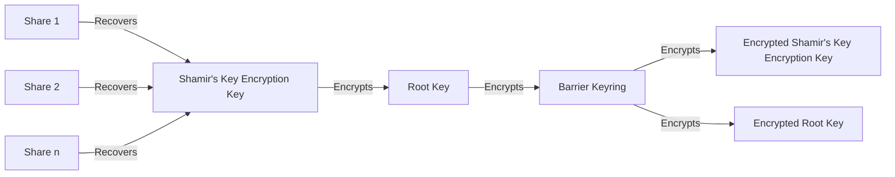
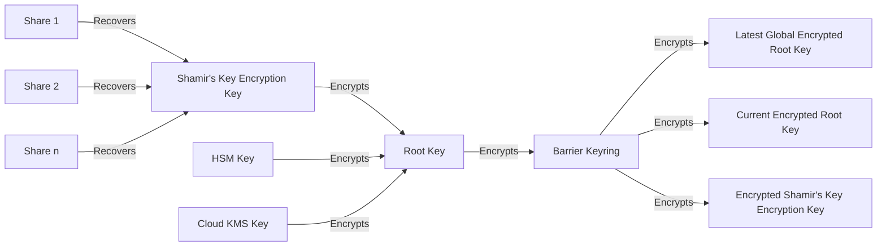
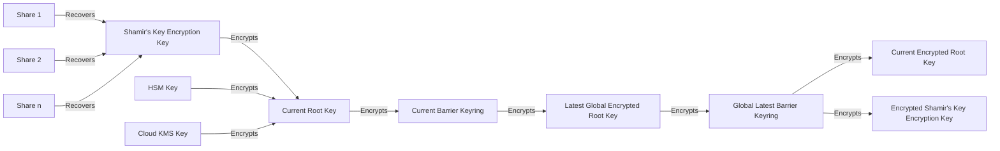

# Parallel Unseal of OpenBao

:::info

This RFC was proposed before the more specialized [emergency
seal](emergency-seal.mdx), which proposes adding one Shamir's seal
as a recovery option when using auto-unseal.

:::

## Summary

OpenBao needs the ability to unseal with one of many pieces of key material to truly solve multi-cloud or multi-data center deployment issues and to provide [outage recovery procedures](https://en.wikipedia.org/wiki/Business_continuity_planning). Setting up a recoverable, distributed system shouldn't rely on a single node having access to all key management systems and operators should have the option to manually recover using Shamir's keys if cloud services are not available.

To differentiate from upstream's solution which has different properties, we prefer to call our solution "Parallel Unseal" rather than "Multi-Unseal".

## Problem Statement

OpenBao's upstream has a history of [introducing](https://github.com/hashicorp/vault/pull/18683), [removing](https://github.com/hashicorp/vault/pull/18942), and subsequently [reintroducing](https://developer.hashicorp.com/vault/docs/configuration/seal/seal-ha) their multi-unseal feature in Vault Enterprise. The following [statement from Melissa Gurney Greene](https://github.com/hashicorp/vault/pull/18683#issuecomment-1425065124) on behalf of HashiCorp is quoted verbatim regrading this feature's history:

> During the development of this feature and corresponding enterprise enhancements, we determined that adoption of this version of the solution would create a potential conflict when migrating to enterprise or vice versa. For example, the original implementation was incompatible with seal wrap, so we withdrew this for a more holistic solution that does not have this inconsistency, which could lead to data loss in some scenarios if the seal wrapped values could no longer be decrypted. Currently we do not have any plans to bring this feature into OSS. We welcome any feedback or suggestions related to OSS seal recovery options due to non-availability of KMS.

From this we learn that the core problem was seal wrapping. While [Seal Wrap](https://developer.hashicorp.com/vault/docs/enterprise/sealwrap) is indeed an issue for Vault Enterprise, it is not present in OpenBao and thus gives us flexibility to choose an alternative solution. Furthermore, Vault Enterprise also has advanced clustering semantics we're unlikely to adopt, [Performance Secondary and Disaster Recovery](https://developer.hashicorp.com/vault/tutorials/enterprise/performance-replication) nodes. This poses a problem for Vault's Multi-Unseal as it introduces node complex topologies; however, they require the remote HSM(s) to be co-online at a single point in time to encrypt data for all nodes.

In designing an alternative for OpenBao, we'd like to consider the following requirements:

 - How can we enable unseal with disconnected HSM topologies? This is equivalent to allowing continued root key rotation operations even if a given seal mechanism is temporarily offline.
    - _Example_: Consider a disaster recovery setup across multiple data centers or cloud environments. A HSM might be available on-premise, but in Google Cloud or AWS, using the provider's KMS might be preferable. These shouldn't require all environments have the same key material nor should they require all KMSes be co-accessible from a single node.
    - For good user experience, this should allow nodes to have _local_ seal configuration: some amount of storage in barrier will need to be used to replicate this config, but we should be able to set node-local connection information for the same or different seal names.
 - Can we enable a [redundant Shamir unseal](https://github.com/openbao/openbao/issues/299) for a break-glass recovery mechanism?
    - _Example_: In the event of an HSM or KMS outage, OpenBao would previously be unable to start. However, by provisioning an additional Shamir's seal, we can allow an operator to start OpenBao using a manual process.
    - As a corollary, this supports different organizational structures. If multiple operational teams use a shared OpenBao instance, they can be issued their own distinct Shamir's recovery shares, allowing any team to initiate fallback startup procedures .
 - Can we allow any one unseal mechanism to start OpenBao?
    - _Example_: A node might have two HSMs available, say, a high-throughput network connected HSM and a fallback USB-attached HSM with limited performance. Allowing any one HSM means that OpenBao has higher resiliency.
 - Can we retain the ability to incrementally rekey OpenBao, even with offline seals?
    - _Example_: If a particular seal mechanism is temporarily offline, we may still want to rotate keys. Past copies of the root key allow rotation of barrier keys. For rotating the root keys, however, access to the seal to perform new encryption operations is required. This can be done incrementally (encrypting the new root behind the current barrier keyring) or by using asymmetric seal mechanisms (like RSA-OAEP or a PQC-secure algorithm in the future).
 - Can we continue to ensure seals are modifiable only by local operators but status is visible over the API?
    - _Example_: Adding a seal is a privileged operation and so should require local filesystem access as many of them read configuration or identities from the disk. Removal of a seal should be possible via API, as a seal may already have been removed from the corresponding configuration file or may no longer be accessible. Status (which seals are in use on connected nodes, &c) should be visible from the API.
 - Can we allow organizations to provide their own key material (BYOK) for auto unseal while ensuring backups can still be restored?
    - _Example_: Fully restore OpenBao on AWS by importing the key material again into KMS and restore a backup snapshot. Or, pre-emptively creating an AWS seal with a public key set in a running node's config, even though it lacks access to the AWS Cloud KMS instance, would allow recovery from a backup, in AWS, in the event of an outage.


We have a few threat modeling parameters:

 - Compromising any one unseal mechanism will still (by definition of parallel unseal, that any one device still grants full access to decrypted storage) mean compromising the entire system.
 - No secret or symmetric key should ever leave the KMS.
 - Operators are ultimately trusted and thus can be made responsible for securely transmitting key material if necessary.

In particular, these requirements mean that we'll want to encourage users to prefer asymmetric keys instead of symmetric keys where possible. The downside is that this means that [later PQC efforts](https://github.com/openbao/openbao/issues/496) will require operators to rotate their unseal keys as asymmetric PQC algorithms become available.

## User-facing Description

To end-users of OpenBao, no changes are expected. This will not impact any user APIs or availability.

However, for operators, we'll see a few changes:

 - Multiple seal stanzas in the configuration will now be accepted.
 - `sys/seal-status` and various other APIs will be updated to allow specifying an explicit seal by name. The default seal used or returned will be the one which succeeded in unsealing this instance or the first one in the config if the instance is currently sealed. When unsealing a manually unsealed instance,

Importantly, over Vault Enterprise we:

 - Do not block seal config modification on requiring all seals be up-to-date,
 - Do not block root or barrier rotation if all seals are not up-to-date,
 - Do not require at least one active node have access to all auto-unseal methods, and

thus greatly improve the operator user experience of this functionality.

### Examples

Presently, one can only unseal OpenBao with a single mechanism: either Shamir's, Transit, a HSM, or a cloud KMS solution. A configuration thus looks like:

```hcl
...

seal "pkcs11" {
  lib = "/usr/lib64/softhsm/libsofthsm.so"
  token_label = "OpenBao"
  pin = "4321"
  key_label = "bao-root-key-rsa"
  rsa_oaep_hash = "sha1"
}

...
```

After running `bao operator init -recovery-shares=3 -recovery-threshold=2`, you'd get an initial root token and three _[recovery key shards](/docs/concepts/seal/#auto-unseal)_. These **only** let you create new root tokens and **do not** let you manually unseal OpenBao in the event of a seal outage during system restart. The OpenBao instance can be restarted and will be automatically unsealed as long as that PKCS#11 device is online.

After this change, operators can define multiple unseal mechanisms for a single node or for different nodes:

```hcl
...

seal "pkcs11" {
  name = "default"
  priority = 1

  lib = "/usr/lib64/softhsm/libsofthsm.so"
  token_label = "OpenBao"
  pin = "4321"
  key_label = "bao-root-key-rsa"
  rsa_oaep_hash = "sha1"
}

seal "transit" {
  name = "backup"
  priority = 2

  address            = "https://openbao-fallback.example.com:8200"
  token              = "s.Qf1s5zigZ4OX6akYjQXJC1jY"
  disable_renewal    = "false"

  // Key configuration
  key_name           = "transit_key_name"
  mount_path         = "transit/"
  namespace          = "ns1/"

  // TLS Configuration
  tls_ca_cert        = "/etc/openbao/ca_cert.pem"
  tls_client_cert    = "/etc/openbao/client_cert.pem"
  tls_client_key     = "/etc/openbao/ca_cert.pem"
  tls_server_name    = "openbao"
  tls_skip_verify    = "false"
}

seal "shamir" {
  name = "emergency"
  priority = 100
}
...
```

Here, an operator would first initialize one seal (using the same command as above). Once initialized and started, the operator could initialize the remaining seals by using a command similar to above but providing the `-seal=transit` flag. In the event of an outage of the PKCS#11 seal, the Transit seal would be tried; if this did not work, Shamir's would be required to manually unseal OpenBao.

When OpenBao is manually sealed, any unseal mechanism's root token recovery keys (or, in the case of a direct `shamir` type seal, the primary unseal keys) may be used to unseal.

## Technical Description

### Existing Design

OpenBao has a three-key hierarchy:



This is the same for auto-unseal keys, swapping Shamir's recovery of the shard's combined key encryption key (KEK) for a key stored in an HSM or KMS solution.

OpenBao uses the following storage entries for unsealing:

1. `barrierSealConfigPath=core/seal-config`, used for storing the configuration of the seal itself, in the case of a Shamir unseal mechanism, or the recovery key information in the case of an auto-unseal mechanism.
2. `StoredBarrierKeysPath=core/hsm/barrier-unseal-keys`, used for storing the encrypted root key.
3. `keyringPath=core/keyring`, used to store the barrier encryption keyring; these keys encrypt all physical storage.

The following additional paths are used to handle rekey operations on standby nodes:

1. `rootKeyPath=core/master` to store a copy of the root key encrypted with the latest encrypted barrier key. In the event of a root key rotation, this allows the standby node to decrypt the latest root key if it is already unsealed.
2. `shamirKekPath=core/shamir-kek` to store a copy of the Shamir's key encryption key for Shamir rekey operations and to restore raft snapshots.

On startup, OpenBao currently loads unseal information either from the auto-unseal device or from provided Shamir's shares. This allows decryption of the root key, which in turn allows decryption of the current barrier keyring, getting us to steady-state. In the case of an auto-unseal mechanism, OpenBao sends the encrypted root key to the mechanism and gets back the decrypted root key; the mechanism's native key material never leaves its boundary.

On certain operations (such as barrier and rot key rotations, Shamir's rekey operations, or snapshot restoration), various ancillary recovery entries are used.

### New Storage Layout

With the above parallel unseal requirements, we do not need to modify the root key entries at all; there will still be only a single root key for all unseal mechanisms. This means we'll need to modify the following entries to create parallel versions:

1. `barrierSealConfigPath` will be migrated to the per-seal location `core/seals/<name>/shamir-config` or `core/seals/<name>/recovery-config` depending on if the mechanism is an auto-unseal mechanism. This is a _raw_ (unencrypted, from Barrier's PoV) storage entry.
2. `StoredBarrierKeysPath` will be migrated to the per-seal location `core/seals/<name>/encrypted-root`. This is a _raw_ (unencrypted, from Barrier's PoV) storage entry; however, this raw entry is encrypted with the seal mechanism's key information.
3. `shamirKekPath` will be migrated to the per-seal location `core/seals/<name>/kek`, when applicable. This is a _barrier-encrypted_ storage entry.
4. For auto-unseal mechanisms, a copy of the seal configuration will be placed inside barrier at `core/seals/<name>/autounseal-config`. This allows for retreival of the public keys of other seal mechanisms and determining if configuration has changed since the last startup. This is a _barrier-encrypted_ storage entry.
5. For each auto-unseal mechanism, we'll store a copy of the barrier keyring encrypted with that seal's current root key at `core/seals/<name>/barrier-keyring`. (Allows you to decrypt the current latest root key.)
6. For each auto-unseal mechanism, we'll store an encrypted copy of the seal's current root key at `core/seals/<name>/current-root`. This is a _barrier-encrypted_ storage entry. (Allows other nodes to rotate the barrier keyring keys.)
7. For each auto-unseal mechanism, we'll store an encrypted copy of the system's global latest root key at `core/seals/<name>/latest-root`; this will be encrypted using the latest key in the per-seal barrier keyring copy (`core/seals/<name>/barrier-keyring`). This is a _barrier-encrypted_ storage entry. (Allows offline nodes to bootstrap from an old barrier keyring.)

Additionally, one unrelated storage change will be made:

1. `rootKeyPath` will be migrated to `core/root-key`, to align with modern naming conventions; this holds the cluster's latest root key. This is a _barrier-encrypted_ storage entry.

Using this design, the following seal diagram will be possible:



When a seal configuration is out of date (due to offline auto-unseal mechanisms as described below regarding barrier and root key rotation), this looks like:



### New Auto-Unseal Configuration Parameters

Similarly to HashiCorp's Vault Enterprise, we'll introduce new parameters:

 - `name`, optional, defaulting to `default` if not specified. This needs to be the same across all instances of that seal's configuration in the cluster.
 - `priority`, an integer, defaulting to `1` if not specified. This is a local-only parameter and does not affect other nodes.

Both `name` and `priority` must be individually unique when multiple config entries are added that are not disabled. That is, only one seal may ever exist with that `name` and only one `priority` may exist.

### New Shamir's Configuration

A new seal type, `shamir`, will be introduced. This allows for multiple parallel Shamir unseals for when any of multiple unseal information should be kept in a secure, secondary location(s). These have the same new parameters above (`name` and `priority`); threshhold and other information will be stored in storage based on the initialization.

### New Unseal Process

1. In order of priority, OpenBao will attempt an unblocking unseal of the instance, skipping any Shamir's seals.
2. If auto-unseal was unsuccessful, OpenBao will block for manual Shamir unseal if such a manual mechanism is present. OpenBao will continue periodically retrying auto-unseal mechanisms in the event they come online later.
3. When providing manual unseal keys, OpenBao will attempt to identify the Shamir seal as follows:
   1. The name provided on the unseal request if present, or
   2. The seal named `default` if it is a Shamir's seal, or
   3. The highest-priority Shamir's seal mechanism.
4. When various barrier or root key rotations have been performed, unseal will locally perform the rotation finalization steps outlined in the rotation section below.

If one or more Shamir's seal mechanism is present and auto-unseal failed, OpenBao will behave like a Shamir's sealed instance. Otherwise, it will behave like a failed auto-unseal mechanism and return applicable errors.

The same detection logic of 3 behaves for the `sys/rekey` API when the explicit `sys/seal/:name/rekey` path was not used.

### Barrier and Root Key Rotation

Shamir seals and seals using asymmetric keys are always online. This means that barrier and root keys can be rotated independently as many times as desired.

However, for auto-unseal mechanisms using symmetric key material, care must be taken to ensure incremental rotation of key material in the event the system initiating the unseal does not have access to that particular mechanism.

Two new per-seal objects, under `core/seals/<name>/barrier-keyring` and `core/seals/<name>/current-root`, ensure the continued operation of these nodes through successful rotation completion. As the barrier keyring is rotated, new versions written using the current root key will be placed under `core/seals/<name>/barrier-keyring`. These can be written as the seal's current root key is stored at `core/seals/<name>/current-root`, even if subsequent root key rotations have occurred since the creation of the auto-unseal encrypted value at `core/seals/<name>/encrypted-root`. This process can be done as many times as desired.

Likewise, the root key can be rotated globally by rewriting the value at `rootKeyPath=core/root-key`: offline auto-unseal mechanisms will not have their per-seal encrypted root at `core/seals/<name>/encrypted-root` updated and so will be able to continue to unseal. The root key will then decrypt either the global barrier keyring (if no keyring rotations have occurred) or the per-seal specific barrier keyring as described above. If the per-seal barrier keyring is out of date and lacks newer barrier keys, this can be recovered by using the temporary keyring to decrypt the per-seal latest copy of the root key (at `core/seals/<name>/latest-root`). This latest root key can then be used to decrypt the latest barrier keyring resuming active operations.

To complete rotation, nodes with local access to symmetric key material will perform a GRPC call up to the active node to complete the rotations. This call will write new values for `core/seals/<name>/barrier-keyring`, `core/seals/<name>/current-root`, and `core/seals/<name>/latest-root`. When this node is the active node, rotation completion can occur immediately via local writes. This will be done in a periodic invocation post-unseal.

This same mechanism will be responsible for providing global knowledge of new seal configuration.

### Rekeying Shamir Shares

No changes to rekeying Shamir shares (whether for unseal or recovery) are necessary.

### Migration Changes

Migration will only be possible when a single seal mechanism is in storage and a second one is migrated to. Otherwise, when two or more seal mechanisms are present in storage (initialized), a new seal mechanism can be added and an old one removed without incurring the migration logic steps.

This can be done online via sending `SIGHUP` to the cluster after modifying the configuration file.

### API & CLI Changes

#### `LIST sys/seals`

This endpoint will return a list of all seals configured across all nodes based on what is present in storage. A corresponding `bao operator seals list` will be added to return a list of seals.

#### `READ sys/seals/:name`

This endpoint will read limited configuration information about a seal and its current status with regards to pending key rotations. A new `bao operator seal read <name>` CLI will be added to query this endpoint.

#### `DELETE sys/seals/:name`

This endpoint delete a configured seal's information in storage, causing irreparable data loss if no other seal is present for that node. The current seal of the active node cannot be deleted. A new `bao operator seal delete <name>` CLI will be added to remove specific seals. This endpoint will require `sudo` permissions.

This allows cleanup of node-specific seal mechanisms when the node is permanently removed.

#### `sys/seal-status`, `sys/seal-status/:name`

The `sys/seal-status` output will return the current node's seal information. This will be the (local) highest priority seal if sealed or else the status of the seal mechanism used to unseal the node.

A new `auto-unseal-health` value will be used to indicate whether one of this node's local seal configuration items is presently able to unseal (due to liveness checks).

When called with an explicit `:name` which is known in the configuration of the local node, the same information will be returned except for that node. `sealed` will always reflect the overall status of the node. Note that entries which exist under `sys/seals` may not be queryable from `sys/seal-status/:name` if they aren't local to this node.

A new CLI, `bao operator seals status <name>` will be added to return the node-specific information about a particular seal mechanism.

#### `sys/init`, `sys/init/:name`

This endpoint will take an optional parameter, `:name`, for the name of the seal. If there is only one, or the system is uninitialized and only has a seal named `default`, this will be chosen.

No re-initialization of the existing storage will be done, if already initialized, but instead additional seals will be brought online and recovery keys returned.

A new `-seal=...` parameter will be added to the `bao operator init` CLI as well.

## Rationale and Alternatives

It would be difficult to create a 1:1 compatible implementation with upstream's implementation. We opt not to do so.

## Downsides

One notable limitation is that existing _recovery keys_ will be unable to function as backup Shamir's unseal keys. This is because the keyshares do not combine to form a copy of the root key encrypting the barrier keyring and instead form an alternative recovery object. While we occasionally allow outdated, historical copies root keys, we do not allow completely disparate root keys to decrypt the barrier keyring. Each auto-unseal mechanism will also have its own recovery key and thus be completely independent of the others.

However, we do explicitly allow additional Shamir's keys which can be used for manual break-glass unseal purposes when mixed with a primary auto-unseal mechanism.

## Security Implications

Modifying seal configuration is always sensitive. The intention of the existing key hierarchy is preserved; additional copies of encrypted key material are stored but no new keys are introduced in the hierarchy and thus security should remain constant with better availability and recovery properties.

The recommendation to use asymmetric cryptography, while not strictly necessary due to asynchronous and non-active node rekeying of symmetric auto-unseal mechanisms, does impact the security due to PQC requirements. It is suggested that we adopt PQC-secure asymmetric algorithms as soon as possible to avoid harvest-now-decrypt-later attacks.

From a threat model perspective, this introduces a one-of-many (weakest-link) attack avenue for a threat actor: any seal may be broken to break information contained within. Various seals may be at different security levels (e.g., a PKCS#11 seal with RSA-2048 versus a GCP CloudKMS instance with RSA-4096) and thus the overall security of the system is the lowest one. However, it doesn't introduce any new security properties not covered by the [original security model](/docs/internals/security/). Additionally, it doesn't institute a m-of-n requirement on unsealing, that is, requiring more than one seal to be operational (including, perhaps, an auto-unseal device and a Shamir's seal) to be operational to unseal OpenBao.

Because an unseal mechanism isn't chosen up front and there is no concept of a recovery/fallback seal in the event of an outage, Shamir's may be used to unseal at any time if all auto-unseal mechanisms did not work. While the Shamir's Key Encryption Key is secure (256-bits), there is an apples-to-oranges comparison of KMS/HSM based auto-unseal mechanisms and a human-in-the-loop Shamir's system. The use of Shamir's for manual unseal is not a requirement and operators wishing for stronger key ownership can simply not use this mechanism.

## User/Developer Experience

No end-user or developer experience should change as a result of this.

## Unresolved Questions

1. Should priority be used and respected (giving operators autonomy) or should we do an implicit priority (based on ordering in the configuration file) or should we execute all unseal operations in parallel?

## Related Issues

OpenBao:

 - https://github.com/openbao/openbao/issues/299
 - https://github.com/openbao/openbao/issues/450
 - https://github.com/openbao/openbao/issues/888 (dupe of #450).

HashiCorp:

 - https://github.com/hashicorp/vault/issues/6046
 - https://github.com/hashicorp/vault/issues/15490
 - https://github.com/hashicorp/vault/pull/18683

## Proof of Concept

tbd
