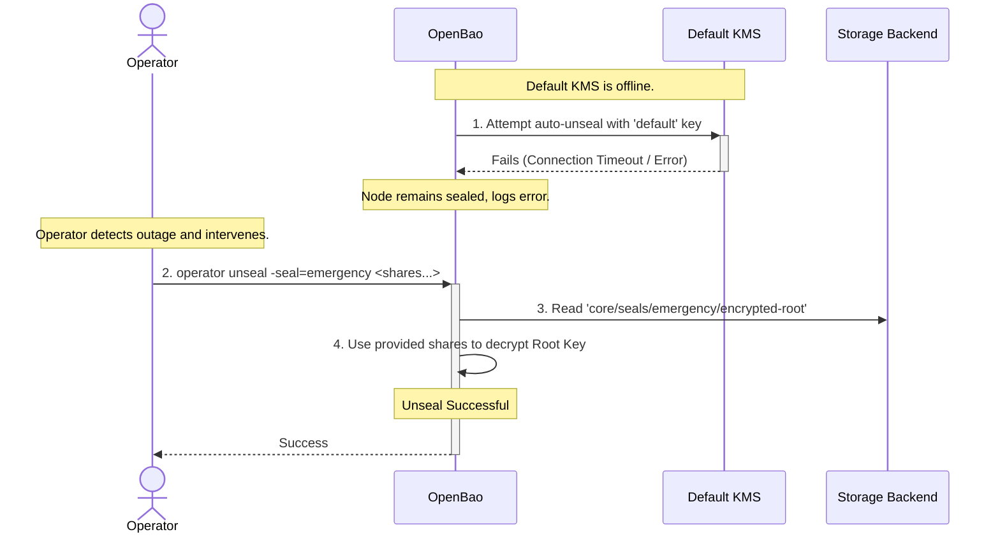
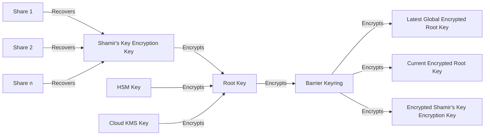
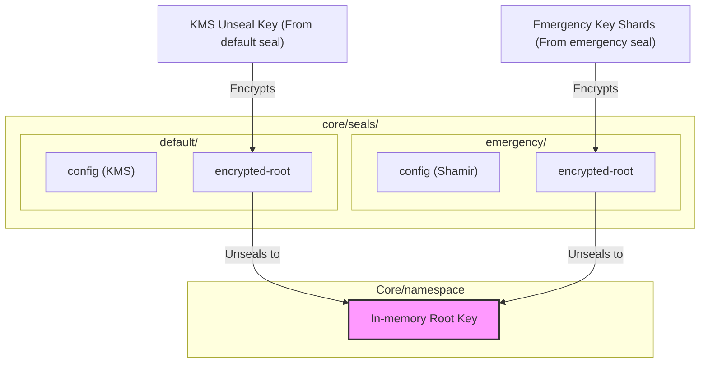
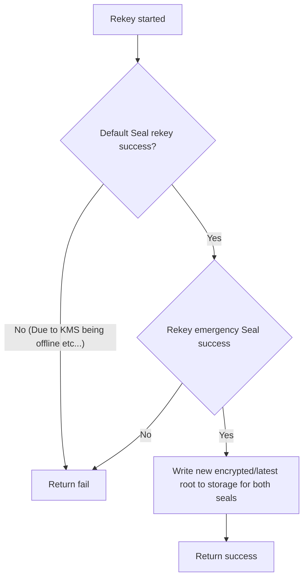

# Emergency Seal

## Summary

This proposal outlines a pragmatic first step towards the long-term goal of
Parallel Unseal. It allows a secondary Shamir's seal to be defined alongside a
primary auto seal. This emergency seal can be used in break-glass scenarios
where the operators lose access to the service backing the auto seal.

An example workflow is as follows:



## Problem Statement

The reliance on a single seal per OpenBao instance/namespace creates a single
point of failure. This poses a significant risk of data inaccessibility if the
auto seal mechanism becomes unusable due to factors outside of an operator's
control (e.g., a KMS going offline, an HSM failure). A "break-glass" emergency
path is highly desirable in this case, where the operator can use a set of
Shamir's key shards to unseal an OpenBao instance or namespace, allowing them to
recover access to the data.

The Parallel Unseal RFC already covers this break-glass use case with a system
designed for unseal resiliency. However, its implementation is a significant
undertaking, primarily due to the complex logic required to allow offline seals
to catch up after a root key rotation. This proposal outlines a phased approach
to partly achieve that vision. By implementing the critical "break-glass"
emergency feature first, we can deliver value faster while also building a
foundation that will seamlessly integrate with the full Paralell Unseal
implementation later.

## User-facing description

### Defining an Emergency Seal

The proposal introduces the concept of an Emergency Seal. This is a manually
configured Shamir's seal that exists alongside a primary auto seal. The user can
define a secondary seal in their configuration. The seal name can be freely
chosen, but the type must be `shamir`.

```hcl
# Primary auto seal
seal "hsm" {
  name = "default"
  ...
}

# Secondary emergency seal
seal "shamir" {
  name = "emergency"
  ...
}
```

### Unsealing with emergency key

If the OpenBao instance or namespace cannot be unsealed using its auto unseal
mechanism, the operator can unseal using the emergency seal by specifying the
emergency seal name. This functions similarly to unsealing using a standard
Shamir's seal.

`bao operator unseal -seal=emergency <share>`

## Technical Description

### Storage

The following storage layout proposed by Parallel Unseal is followed by this
proposal. This allows for forward compatibility with Parallel Unseal while also
enabling us to have multiple paths to the root key.

> **_NOTE:_** The diagram below is from Parallel Unseal, which supports an
> arbitrary number of seals. The approach in this proposal only supports 2
> seals: a primary auto seal and an emergency Shamir's seal.



The following diagram describes a sample storage setup with emergency seal in place.



The emergency seal is stored in storage as a fully-formed, indepedent seal
configuration in its own storage path (e.g., `core/seals/emergency`). This means
the emergency key can be used to decrypt the encrypted root key, effectively
unsealing the OpenBao instance/namespace.

### Rekeying (Root key rotation)

The Parallel Unseal RFC has a mechanism for offline seal configurations to catch
up when a root key rotation has occurred even after multiple root key or key
ring rotations. In this proposal, we will enforce an operational constraint to
simplify the implementation: the root key rotation operation will be blocked if
the primary auto seal is offline. This constraint ensures that the root key for
every seal is always consistent, eliminating the need for a catch-up mechanism.



### Barrier key rotation

Since barrier key rotation doesn't require the seal mechanism to be online,
rotation is always allowed.

### API & CLI changes

To ensure forward compatiblity and reduce future work, the API and CLI changes
adopt relevant specifications proposed by Parallel Unseal.

---

`POST sys/unseal`

This endpoint will have a new optional parameter `seal` to specify the seal. It
defaults to the primary seal.

```
{
  "key": "abcd1234..."
  "seal": "emergency"
}
```

Similarly, `bao operator unseal` will have an optional `-seal` parameter

```
bao operator unseal -seal=emergency abcd1234...
```

---

`sys/init`, `sys/init/:name`

This endpoint will take an optional parameter, `:name`, for the name of the
seal. It defaults to the primary seal.

No re-initialization of the existing storage will be done, if already
initialized, but instead additional seals will be brought online and recovery
keys returned.

A new `-seal=...` parameter will be added to the `bao operator init` CLI as
well.

For example, in a node/namespace with both a primary auto seal and a secondary
Shamir's seal named `my-emergency`, the operator would run `bao operator init`
to initialize the primary seal, and `bao operator init -seal=my-emergency ...`
to initialize the emergency seal.

---

`sys/seal-status`, `sys/seal-status/:name`

This endpoints takes a new optional `:name` parameter, which also defaults
to the primary seal.

The CLI `bao operator seals status <name>` will be added.

## Rationale and Alternatives

While the use case is already covered by Parallel Unseal, the design proposed in
this RFC can be implemented at a lower complexity and effort, helping us support
the break-glass emergency scenario faster.

This approach acts as the first building block for the full Parallel Unseal
implementation. A key advantage is the immediate gain of a clean separation of
concerns by having the emergency seal in its own stanza. Because this is a
direct subset of the final design, it is automatically forward-compatible,
allowing the remaining Parallel Unseal features to be built on top of this work
in a future release.

### Alternative: Allow recovery keys to unseal

An alternative to this proposal was considered: allowing the recovery keys
of the auto seals to function like unseal keys. The user can opt in to this
feature by specifying a flag (`enable_recover_seal`) in the seal configuration.

```hcl
seal "hsm" {
  name = "default"
  enable_recovery_seal = true
  ...
}
```

The same storage structure and operation constraint (root key rotation not
allowed if auto seal is offline) still apply here. The notable difference is
that no new key materials are generated for the break-glass path, since the
recovery key shards are reused here.

This approach has an advantage in user experience: users may find it more
intuitive that the recovery keys can be used to recover an instance/namespace
whose auto seal is blocked.

However, it was decided against for the following downsides:
* Overloading key functions: it gives a single set of keys different
  functionalities: resuming auto unsealing, generating root tokens and now
  directly unsealing.
* Introduces a "Special" Seal Type: This method creates a tightly coupled
  relationship between an auto seal and its emergency seal. This concept of a
  "linked" seal is a special case that diverges from the purer model of fully
  independent seals envisioned in the full Parallel Unseal RFC, adding a small
  amount of logical complexity to the codebase.

## Downsides
* Increased operator burden: operators must now generate and securely manage a
  second set of keys.
* Operational constraint: if the primary seal is offline, the root key cannot be
  rotated. This constraint will be lifted when Parallel Unseal is implemented.
* Potentially unintuitive recovery keys: some users may find it unintuitive that
  recovery keys cannot be used to unseal. The documentation needs to emphasize
  this to prevent confusion

## Security Implications
Similar to Parallel Unseal, adding another path to unseal the instance widens
the attack surface. The compromise of a single seal could lead to the compromise
of the entire OpenBao instance or namespace protected by it.

This represents the trade-off of this feature: an improvement in operational
resilience at the cost of an increase in the attack surface.

## User/Developer Experience

The primary experience improvement is for operators during an outage. They can
now define a secondary Shamir's seal that functions as an escape hatch in case
the auto seal is inaccessible.

The manual unseal process is largely unchanged but will require specifying the
seal name with the `-seal` flag on the CLI or the `seal` parameter in the API.

## Unresolved Questions

## Related Issues
- https://github.com/openbao/openbao/issues/299
- https://github.com/openbao/openbao/issues/888

## Proof of Concept
tbd
