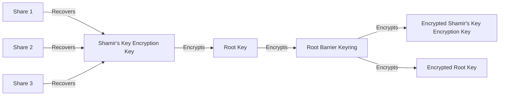
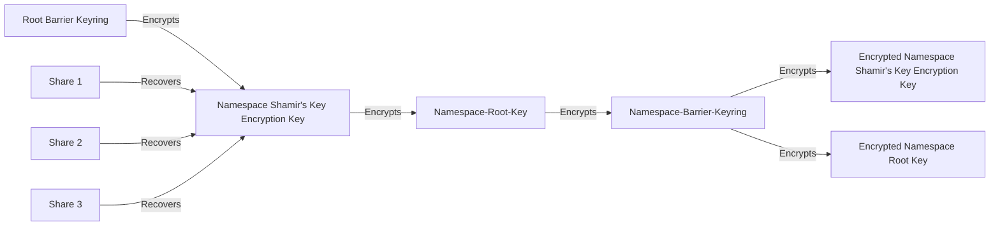

# Per-Namespace Sealing

## Summary

Introduce a per-namespace sealing mechanism to extend OpenBaos multi-tenancy capabilities. Using Barrier + Keyring functionality, we want to create a mechanism to enable per-tenant encryption, which lets a tenant control their own encryption keys. By implementing per-namespace encryption, OpenBao can provide a more robust and flexible multi-tenancy solution, addressing the current limitations and offering tenants more significant control over their data security and availability.

## Problem Statement

The introduction of namespaces in OpenBao has paved the way for multi-tenancy capabilities, allowing multiple tenants to operate on the same instance while maintaining logical isolation of data. However, this isolation is currently limited to logical hierarchy, and several areas need further improvement to provide tenants with greater control, sovereignty, and security over their data. These limitations include:

* **Global Sealing:** The current implementation of (un)sealing affects all namespaces simultaneously. This means tenants lack independent control over the availability of their specific namespace.
* **Limited Namespace Control:** Tenants do not have full control over the lifecycle of their namespace, including the ability to lock, unlock, seal, or unseal independently of other tenants.
* **Shared Encryption Keys:** Tenants must rely on the OpenBao operator's cryptographic implementation, as they have no authority over the keys used to encrypt and decrypt their secrets.

To address these limitations, this RFC proposes implementing "Per-Namespace Sealing". This feature would provide the following benefits:

* Independent Sealing: Tenants would be able to seal and unseal their namespaces independently without affecting other tenants' data availability.
* Tenant-Controlled Encryption: Each namespace would have its own encryption keys, giving tenants full authority over the cryptographic security of their data.
* Enhanced Namespace Lifecycle Management: Tenants would gain more control over the lifecycle of their namespace, including the ability to lock, unlock, seal, and unseal as needed.


## User-facing description

### Creating a Sealed namespace

A sealed namespace is created by providing a special option to the namespace create API call.
The default sealing method is [Shamir’s Secret Sharing Algorithm](https://en.wikipedia.org/wiki/Shamir%27s_Secret_Sharing). However, other [sealing configurations](https://openbao.org/docs/configuration/seal/) that are already supported for global sealing should also be supported for per-namespace sealing.

### Sealed Namespace

Sealing an OpenBao Namespace pauses the Server's operations aimed at that namespace until a tenant operator decides to unseal it. Equal to global sealing, this means that a sealed namespace discards its in-memory namespace-root key (which is required to decrypt the dedicated namespace encryption key), which physically prevents responding to operations when sealed.

If an unsealing is in progress, sealing the namespace will reset the unsealing process. Users will have to re-enter their shares of the namespace key again.

Sealing an already sealed namespace has no effect.

Namespace sealing is optional. By default, namespaces are created without per-namespace sealing, and they are part of the global sealing/unsealing process. Namespace sealing only affects custom namespaces. The root namespace and namespaces without a sealing config are not affected.

While it has some behavior in common, sealing is a distinct feature from locking/unlocking a namespace.

### Unsealing a Namespace

OpenBao starts in a sealed state. Only after the global OpenBao unseal process is concluded, unsealing a namespace is possible.

Unsealing a namespace allows the tenant to decrypt its data and allow operations on that namespace. No operations can be performed on a sealed namespace.

Once an OpenBao namespace is unsealed, it remains unsealed until one of these things happens:

* It is resealed via the API (see below).
* The server is restarted.
* OpenBao's storage layer encounters an unrecoverable error.

### Auto-Unsealing

Auto-Unsealing (non-interactive unsealing) is an option that can be used to automatically unseal a namespace with the namespace-root key and appropriate configuration. 

Auto-Unsealing is considered an important feature, as it will be extremely handy for nested (sealed) namespaces, as structures like `sealed-n1/sealed-ns2/ns3/sealed-ns4` are possible.

As the default sealing mechanism is Shamir, auto-unsealing is not the default. Shamir requires a tenant to interactively enter key shares, which makes the auto-unsealing impossible.

### Namespace Lifecycle Options

Per-namespace encryption moves parts of the responsibility away from the operator, closer to the tenant. Therefore, some life cycle features known from the global sealing/unsealing level also need to exist on namespace level:

* Rekeying: In case a namespace-root-key needs to be changed (e.g. because of a leak), revoking the old and creating a new key needs to be possible.
  * Rekeying can only be started with valid namespace key
* Rekeying of Unseal Key
  * Rekeying of Unseal Keys can only be started with a valid namespace key
* Key Recovery
* Rekeying of recovery key

The global root key is unable to decrypt data of sealed namespaces.
Only users with appropriate permissions can trigger any kind of rekey.


## Technical Description

### Unseal Process

#### Key Hierarchy

##### Existing Key Encryption-Design

Currently, OpenBao has a three-key hierarchy:



This is the same for auto-unseal keys, swapping Shamir's recovery of the shard's combined key encryption key (KEK) for a key stored in an HSM or KMS solution.

**Proposal for a Namespace scoped Barrier-Keyring:**



With Per-Namespace Sealing, the responsibility of Root Barrier Keyring will be extended. Root Barrier Keyring will be used to encrypt the Shamirs Key Encryption Key (KEK) for a Namespace. This has the implication that a Namespace Shamirs KEK first needs to be decrypted (Global needs to be unsealed) before a namespace can be unsealed.

### Unsealing Process

1. OpenBao will attempt an unblocking unseal of each sealed namespace (all namespaces with sealing config), skipping Shamir seals
   - on success: namespace will work as expected and requests can be answered
   - on fail: namespace remains sealed; returns applicable errors; status can be retrieved from namespace-status endpoint; periodic retry (as HSM can be temporarily unavailable etc.)

1. OpenBao global unseal is successful
2. OpenBao will attempt an unblocking unseal of each sealed namespace (all namespaces with sealing config), skipping Shamir seals
   - on success: namespace will work as expected and requests can be answered
   - on fail: namespace remains sealed; returns applicable errors; status can be retrieved from namespace-status endpoint; periodic retry (as HSM can be temporarily unavailable etc.)3. For namespaces that could not be auto-unsealed (and do not have a sealing config), OpenBao allows manual shamir unseal via the respective namespace specific api endpoint.  
   Note: OpenBao will not globally block if single Namespaces remain sealed
4. When various namespace-barrier or namespace-root-key rotations have been performed, unseal will locally perform the rotation finalisation steps outlined in the rotation section below.

### Encryption

While namespaces logically can be used in a hierarchy, on storage level they are laid out in a flat list. This means we can encrypt each namespace individually and on a global level.


At the level of the global sealing we use the root-key to encrypt the list of namespaces including their metadata and configuration. With access to this data, each individual namespace can be decrypted by auto-unseal or a tenant with the namespace-root-key.

For data this means, we encrypt it twice: first with the namespace encryption key, second with the root encryption key.

**Pros:**
leaked namespace encryption keys are less of an issue as data at rest is still protected by root encryption key

**Cons:**
in backup/restore scenarios the root encryption key must be known

### Storage Considerations

We will introduce a new namespace scoped root key `ns-root-key`, which has similar responsibility as the root key on global level.

We do not need to change the existing root key entries, as they are unrelated. However, we need namespace specific entries for keys and config. The idea is, to generally follow the storage logic of the [Parallel Unseal RFC](https://github.com/openbao/openbao/issues/1021), so we will be semantically in harmony with future changes to  global sealing mechanisms. Please note, this RFC does not support parallel unsealing of namespaces.

| **Location** | **Description** |
|------------ | -------------|
|`namespaces/<ns-uuid>/core/seals/shamir-config` OR <br/>`namespaces/<ns-uuid>/core/seals/recovery-config` | It stores the configuration of the seal itself.<br/><br/>Can be shamir-config or config for auto-unseal mechanism.<br/><br/>This is a *raw* (unencrypted, from Barrier's PoV) storage entry, as it needs to be accessible in case of a sealed namespace. |
|`namespaces/<ns-uuid>/core/seals/encrypted-ns-root` | Used for storing the encrypted namespace-root key.<br/><br/>This is a raw (unencrypted, from Barrier's PoV) storage entry; however, this raw entry is encrypted with the seal mechanism's key information. |
|`namespaces/<ns-uuid>/core/seals/kek`<br/>(when applicable) | Storing a copy of the Shamir’s key for Shamir rekey operations and to restore raft snapshots.<br/><br/>This is a **barrier-encrypted** storage entry. |
|`namespaces/<ns-uuid>/core/seals/autounseal-confi` | This allows for retrieval of the seal mechanisms and determining if configuration has changed since the last startup. <br /><br />This is a **barrier-encrypted** storage entry. |
|`namespaces/<ns-uuid>/core/seals/barrier-keyrin` | We'll store a copy of the barrier keyring encrypted with that seal's current namespace-root key.<br/><br/>(Enables decryption of the current latest root key.) |
|`namespaces/<ns-uuid>/core/seals/current-roo` | We'll store an encrypted copy of the seal's current namespace-root key<br/><br/>This is a **barrier-encrypted** storage entry. (Allows other nodes to rotate the barrier keyring keys.) |
|`namespaces/<ns-uuid>/core/ns-root-ke` | It stores the cluster’s latest namespace specific root key.<br/><br/>This is a **barrier-encrypted** storage entry. |

### Namespace specific Keyring and Barrier

To let a tenant control their own encryption keys, we will need to introduce a per-namespace keyring and barrier. While I assume we can reuse code in [vault/keyring.go](https://github.com/openbao/openbao/blob/main/vault/keyring.go) and [vault/barrier.go](https://github.com/openbao/openbao/blob/main/vault/barrier.go#L73), we might consider some naming/semantic changes. A namespace specific Keyring does not have a rootKey, but a namespaceRootKey. Similarly, some method names of the SecurityBarrierCore interface might be misleading in the context of a namespace (e.g. SetRootKey, ReloadRootKey ).

### Migration

To keep this feature simple, the migration path from an existing normal namespace to a sealed namespace is not discussed here. The proposed migration path would be via export/import.

### API & CLI Changes

We need to extend the create namespace API to enable creating sealed namespaces.
We need to create new endpoints per namespace to trigger sealing and unsealing.
The functionality needs to be exposed by the HTTP API and the bao namespace subcommand of the CLI.

If a namespace is sealed, any requests to this namespace's resources should be handled similar to a locked namespace.

#### Creating a Sealed Namespace

| **Method** | **Path**                |
| ---------- | ----------------------- |
| `POST`     | `/sys/namespaces/:path` |

##### Additional Parameters

The following Parameter will be added to the existing list of parameters:

- seals (`[]map<string|string>: nil`) - A list containing maps of user-provided string to string key value pairs, containing sealing configuration.

<details>

<summary>Collapse Example</summary>

##### Payload

```json
{
  "custom_metadata": {
    "foo": "bar"
  },
  "seals": [{
    "type": "shamir",
    "name": "default",
    "key_shares": 5,
    "key_threshold": 3,
  }]
}
```

##### Example

```bash
$ curl \
    --header "X-Vault-Token: ..." \
    --request POST \
    --data @payload.json \
    http://127.0.0.1:8200/v1/sys/namespaces/sealednamespace1
{
  "request_id": "1871d69e-38fe-1804-68be-a4a049e349cd",
  "lease_id": "",
  "renewable": false,
  "lease_duration": 0,
  "data": {
    "custom_metadata": {
      "foo": "bar"
    },
    "id": "1XFxHV",
    "path": "foo/",
    "uuid": "35c784cf-90b8-42a6-dd29-c8e33edfb4db"
    unseal_keys: [
        {
            key: "sP/4C/fwIDjJmHEC2bi/1Pa43uKhsUQMmiB31GRzFc0R",
            number: "1"
        },
        {
            key: "kHkw2xTBelbDFIMEgEC8NVX7NDSAZ",
            number: "2"
        },
        {
            key: "+1+1ZnkQDfJFHDZPRq0wjFxEuEEHxDDOQxa8JJ/AYWcb",
            number: "3"
        },
        {
            key: "cewseNJTLovmFrgpyY+9Hi5OgJlJgGGCg7PZyiVdPwN0",
            number: "4"
        },
        {
            key: "wyd7rMGWX5fi0k36X4e+C4myt5CoTmJsHJ0rdYT7BQcF",
            number: "5"
        },
    ],
  },
  "wrap_info": null,
  "warnings": null,
  "auth": null
}
```

</details>

Sealing stanzas for KMS and PKCS#11 follow [the existing ones](https://openbao.org/docs/configuration/seal/).

For PKCS#11 there are some more restrictions: first, OpenBao requires a physical connection to an existing HSM. Second, it can only support the PKCS#11 library that is already present on the machine OpenBao is running on. Therefore, the lib field should not be configurable.

Note: [Parallel Unsealing](https://github.com/openbao/openbao/issues/1021) on namespace level is considered a future improvement

#### Sealing of a Namespace

| **Method** | **Path**                     |
| ---------- | ---------------------------- |
| `PATCH`    | `/sys/namespaces/:path/seal` |

<details>

<summary>Collapse Example</summary>

##### Example

```bash
$ curl \
  --header "X-Vault-Token: ..." \
  --request PATCH \
  http://127.0.0.1:8200/v1/sys/namespaces/sealednamespace1/seal
```

</details>

#### Unsealing of a Namespace

| **Method** | **Path**                       |
| ---------- | ------------------------------ |
| `PATCH`    | `/sys/namespaces/:path/unseal` |

##### Additional Parameters

- token (`string: nil`) - A Shamirs token.

<details>

<summary>Collapse Example</summary>

##### Payload

```json
{
 "token": "token"
}
```

##### Example

```bash
$ curl \
  --header "X-Vault-Token: ..." \
  --request PATCH \
  http://127.0.0.1:8200/v1/sys/namespaces/sealednamespace1/unseal
{ shamir tokens … }
```

</details>

- Creating a sealed namespace requires a root key. After creation, (un)sealing of the namespace requires the namespace key. A root key can not (un)seal.

#### Retrieve Sealing status of a Namespace

Note: contrary to existing /sys/seal-status, the namespace specific endpoint is authenticated.

| **Method** | **Path**           |
| ---------- | ------------------ |
| `GET`      | `/sys/namespaces/:path/seal-status` |

<details>

<summary>Collapse Example</summary>

##### Example

```bash
$ curl \
  --header "X-Vault-Token: ..." \
  --request GET \
  http://127.0.0.1:8200/v1/sys/namespaces/sealednamespace1/seal-status
```

</details>

##### Additional Endpoints

Furthermore, the following endpoints will need to be adjusted, so that they are (optionally) namespace aware, by providing X-Vault-Namespace and X-Vault-Token headers.

- `/sys/generate-recovery-token`
- `/sys/generate-root`
- `/sys/key-status`
- `/sys/rekey`
- `/sys/rekey-recovery-key`
- `/sys/rotate`
- `/sys/rotate/config`
- `/sys/seal`
- `/sys/seal-status`
- `/sys/unseal`

### Policies

We probably need to extend Policies, so that we can configure various permissions to for namespace specific actions like sealing, rekeying, key rotation of a namespace.


## Rationale and alternatives

Per-namespace encryption moves parts of the responsibility away from the OpenBao operator and closer to the tenant, giving more granular control over its data.

There are no direct alternatives to this feature proposal. It must be highlighted that a feature of (un)locking of a namespace alone is not an alternative to this proposal, as data sovereignty can’t be achieved. However, it could be a first step towards this direction and could be considered a preparation.

### Parallel Unseal

[RFC #1021](https://github.com/openbao/openbao/issues/1021) discussed the a Parallel Unsealing mechanisms to support multiple unseal factors such as Shamirs and KMS. As the RFC only addresses issues of global unsealing, it could be either extended or a new RFC can be written to account for parallel unsealing of Namespaces.

### Lazy Loading of Mounts, Namespaces

Coupled with per-namespace seal mechanisms, one issue with this is that it requires all devices to be online at the time of cluster restart. Instead, one could imagine swapping loading of mounts to be lazily done: this might allow the cluster to start if certain tenants do not have online KMS or HSMs at the time of cluster start, but puts greater availability requirements on these systems in general.

However, this work is strictly disjoint from implementing per-namespaces sealing as a feature and so will be done later.


### Downsides

This will add another complex feature to OpenBao; however, this substantially increases competitiveness in the broader Vault Enterprise ecosystem.

## Security Implications

Per-Namespace encryption would increase tenant security, as there is no single key encrypting all of OpenBaos data.

## User/Developer Experience

Users and system managers should expect the same experience as the non-namespace OpenBao. This should have interoperability with the broader Vault Enterprise-aware ecosystem.
* 
* Improved Security Isolation: Tenants can implement their own security policies and key management practices without relying on the global OpenBao configuration.
* Compliance and Regulatory Requirements: Organizations with strict data sovereignty or compliance requirements can maintain full control over their encryption keys and data access.
* In case of a leaked encryption key, affected namespaces can be sealed and rekeyed independently, minimizing the impact on other tenants.

## Unresolved Questions

* In OpenBao, Shamir's technique can be disabled, so the root key can be used directly for unsealing. Should there be a similar option for namespace (un)sealing)? (https://openbao.org/docs/internals/architecture/)
* Terminology to decide on:
  * Root Seal/Global Seal
  * Key used to encrypt a namespace
    * namespace-root-key (nsr-key)
    * namespace-encryption-key
    * namespace-key


## Related Issues

_No response_

## Proof of Concept

_No response_
