# Per-Namespace Sealing

## Summary

Introduce a per-namespace sealing mechanism to extend OpenBao's tenant separation
capabilities. Expanding the Barrier + Keyring functionality, we want to create a
mechanism to enable per-tenant encryption, which lets a tenant control their own
seal keys in their namespace. OpenBao can thus provide a more robust and flexible
multi-tenancy solution, addressing the shared encryption limitations and offering
tenants more significant control over their data security and availability.

## Problem Statement

The introduction of namespaces in OpenBao has paved the way for multi-tenancy
capabilities, allowing multiple tenants to operate on the same instance while
maintaining logical isolation of data. However, this isolation is currently
limited to logical hierarchy, and several areas need further improvement to
provide tenants with greater control, sovereignty, and security over their data. 
These limitations include:

* **Global Sealing:** The current implementation of (un)sealing affects all
   namespaces simultaneously. This means tenants lack independent control over
   the availability of their specific namespace.
* **Limited Namespace Control:** Tenants do not have full control over the 
   lifecycle of their namespace, including the seal and unseal independently
   of other tenants.
* **Shared Encryption Keys:** Tenants must rely on the OpenBao operator's 
   cryptographic implementation, as they have no authority over the keys used to
   encrypt and decrypt their data.

To address these limitations, this RFC proposes implementing "Per-Namespace Sealing". 
This feature would provide the following benefits:

* Independent Sealing: Tenants would be able to seal and unseal their namespaces
  independently, without affecting other tenants' data availability.
* Tenant-Controlled Encryption: Each namespace would have its own encryption keys,
  giving tenants full authority over the cryptographic security of their data.

## User-facing description

### Creating a Sealed Namespace

A sealed namespace is created by providing a special option to the namespace create
API call. The default sealing mechanism is [Shamir's Secret Sharing Algorithm](https://en.wikipedia.org/wiki/Shamir%27s_Secret_Sharing).
However, other [seal configurations](https://openbao.org/docs/configuration/seal/) 
already supported for global (root) sealing should also be supported for
per-namespace sealing.

### Sealing a Namespace

Sealing a namespace pauses the server's operations aimed at that namespace until
a tenant operator decides to unseal it. Equal to global sealing, this means that
a sealed namespace discards its in-memory namespace barrier keyring and namespace
root key (required to decrypt the dedicated namespace barrier keyring), which
prevents responding to operations when sealed.

Sealing an already sealed namespace has no effect.

Sealing a namespace also seals all of its children recursively.

Namespace sealing is optional. By default, namespaces are created without sealing
configuration and they are part of their parent namespace's sealing/unsealing
process. Namespace sealing only affects new namespaces created with explicitly
provided sealing configuration. The root namespace and namespaces existing prior
to introduction of per-namespace sealing are not affected.

While it has some behavior in common, sealing is a distinct feature from 
locking/unlocking a namespace.

### Unsealing a Namespace

OpenBao starts in a sealed state. Only after the global OpenBao unseal process
is concluded, unsealing of a (non-root) namespace is possible.

Unsealing a namespace allows the tenant to decrypt its data and allows operations
on that namespace. Unsealing is the only operation that can be performed on 
a sealed namespace.

Once a namespace is unsealed, it remains unsealed until one of the below events
happen:

* It is resealed via the API (see below).
* The server process is restarted.
* OpenBao's storage layer encounters an unrecoverable error.

### Auto-Unsealing

Auto-Unsealing (non-interactive unsealing) is an option that can be used to
automatically unseal a namespace with the namespace root key and appropriate
configuration. 

Auto-Unsealing is considered an important feature, as it is convenient in case
of multiple nested (sealed) namespaces, with an example structure of 
`sealed-n1/sealed-ns2/ns3/sealed-ns4`. The default sealing mechanism is Shamir, 
requiring a tenant to manually enter unseal key shares, which is incompatible
with an automatic unsealing process.

### Namespace Lifecycle Options

Per-namespace encryption moves parts of the responsibility away from the operator,
and closer to the tenant. Therefore, some lifecycle features known from the global
sealing/unsealing level also need to exist on a per-namespace level:

* Keyring rotation
* Root/Recovery Key rotation
* Backup of rotated unseal/recovery keys

The global root key is unable to decrypt data of sealed namespaces.
Only users with appropriate permissions can trigger any kind of rotation.

## Technical Description

### Unseal Process

#### Key Hierarchy

##### Existing Key Encryption-Design

Currently, OpenBao has a three-key hierarchy:


This is the same for auto-unseal keys, swapping Shamir's recovery
of the shard's combined key encryption key (KEK) for a key stored
in an HSM or KMS.

**Proposal for a Namespace scoped Barrier-Keyring:**


### Unsealing Process

With Per-Namespace Sealing, the responsibility of the Root Barrier Keyring will be 
extended. The parent namespace's Barrier Keyring will be used to encrypt the sealed
namespace's stored Shamir's Key Encryption Key (KEK). This has the implication that
a Namespace Shamir's KEK first needs to be decrypted (implying that the parent or
root namespace needs to be unsealed) before a namespace can be unsealed.

1. OpenBao global unseal is successful.
2. OpenBao will attempt an unblocking unseal of each sealed namespace (namespaces
   with sealing config), skipping namespaces configured with Shamir seals:
   - on success: namespace will work as expected and requests can be answered.
   - on fail: namespace remains sealed; returns applicable errors; status can be
     retrieved from namespace-status endpoint; periodic retry (as HSM can be
     temporarily unavailable etc.).
3. For namespaces that are not configured with Auto-Unseal, OpenBao allows manual
   shamir unseal via the respective namespace specific API endpoint.
   Note: OpenBao will not globally block if a single namespace remains sealed.
4. When various namespace-barrier or namespace-root-key rotations have been
   performed, unseal will locally perform the rotation finalisation steps outlined
   in the rotation section below.

### Encryption

While namespaces logically can be used in a hierarchy, on storage level they are
laid out in a flat list. This means we can encrypt each namespace individually
and on a global level.

```mermaid
graph
    subgraph "Root (sealed)"

        SS_Root["Shamir-1..5 🔑<br/>Key shares / Unseal Keys"] --> |unseal root| RK["root key 🔑"]
        RK --> EK["encryption key 🔑"]

        %% Branching Point from the main Encryption Key
        EK --> |encrypts| Branch{ }
        style Branch fill:none,stroke:none,width:0,height:0

        %% Path for Namespace 1 (Shamir unseal)
        Branch ---> SC_NS1["Shamir config"]
        subgraph "Namespace 1 (sealed)"
            NSRK1["namespace-1<br/>root-key 🔑"] --> |encrypts| NSEK1["namespace<br/>encryption key 🔑"]
        end
        SC_NS1 --> NSRK1
        SS_NS1["Shamir-1..5 🔑<br/>Key shares / Unseal Keys"] --> |unseal Namespace 1| NSRK1

        %% Path for Namespace 2 (already unsealed)
        Branch --> |"Namespace 2 is already<br/>unsealed as part of root"| NS2[Namespace 2]

        %% Path for Namespace 3 (KMS unseal)
        Branch --> KMS["KMS<br/>KMS Configuration"]
        subgraph "Namespace 3 (sealed)"
            NSRK3["namespace-2<br/>root-key 🔑"] --> |encrypts| NSEK3["namespace<br/>encryption key 🔑"]
        end
        KMS --> |unseal Namespace 3| NSRK3
    end
```


At the level of the global sealing we use the root key to encrypt the list of
namespaces including their metadata. The seal configuration of a namespace is
encrypted by the barrier key of the next sealable namespace upward in the
hierarchy. With access to this data, each individual namespace can be decrypted
by an auto-unseal mechanism or a tenant with the namespace root key.

### Storage Considerations

We do not need to change the existing root key entries, as they are unrelated.
However, we need namespace specific entries for keys and config. The idea is to
generally follow the storage logic of the [Parallel Unseal RFC](https://github.com/openbao/openbao/issues/1021),
so we will be semantically in harmony with future changes to the global sealing
mechanisms. Please note that this RFC does not include or describe parallel
unsealing of namespaces.

| **Location** | **Description** |
|------------- | --------------- |
|`namespaces/<ns-uuid>/core/seals/<name>/shamir-config` OR <br/>`namespaces/<ns-uuid>/core/seals/<name>/recovery-config` | Stores the configuration of the (Shamir) seal.<br/><br/>Can be root or recovery shamir-config.<br/><br/>This storage entry is encrypted with the parent namespace's barrier, as it needs to be readable during unsealing of the namespace. |
|`namespaces/<ns-uuid>/core/seals/<name>/encrypted-root` | Stores the encrypted namespace root key. |
|`namespaces/<ns-uuid>/core/seals/<name>/kek`<br/>(when applicable) | Stores a copy of the Shamir's key for Shamir rotation and to restore raft snapshots.<br/><br/>This is a **barrier-encrypted** storage entry. |
|`namespaces/<ns-uuid>/core/seals/<name>/autounseal-config` | Stores the configuration of the (auto-unseal) seal. <br /><br />This is a **barrier-encrypted** storage entry. |
|`namespaces/<ns-uuid>/core/seals/<name>/barrier-keyring` | Stores a copy of the barrier keyring encrypted with that seal's current namespace root key.<br/><br/>(Enables decryption of the current latest root key.) |
|`namespaces/<ns-uuid>/core/seals/<name>/current-root` | Stores an encrypted copy of the seal's current namespace root key<br/><br/>This is a **barrier-encrypted** storage entry. (Allows other nodes to rotate the barrier keyring keys.) |
|`namespaces/<ns-uuid>/core/seals/<name>/latest-root` | Stores the cluster's latest namespace specific root key.<br/><br/>This is a **barrier-encrypted** storage entry. |

### Namespace specific Keyring and Barrier

To let a tenant control their own encryption keys, we will need to introduce a
per-namespace keyring and barrier. While it is assumed that we can reuse code in
[vault/keyring.go](https://github.com/openbao/openbao/blob/main/vault/keyring.go)
and [vault/barrier.go](https://github.com/openbao/openbao/blob/main/vault/barrier.go#L73),
we might consider introducing some naming/semantic changes.

### Migration

To keep this feature simple, the migration path from an existing normal namespace
to a sealed namespace is not discussed here. The proposed migration path would be
via export/import.

### API & CLI Changes

An extension of the namespaces API endpoint to enable creation of sealed
namespaces, and addition of new endpoints per namespace to trigger sealing and
unsealing are required. These functionalities need to be exposed by the HTTP API
and the bao namespace subcommand of the CLI.

If a namespace is sealed, any requests to this namespace's resources should be
handled similar to a locked namespace.

#### Creating a Sealed Namespace

| **Method** | **Path**                |
| ---------- | ----------------------- |
| `POST`     | `/sys/namespaces/:name` |

##### Additional Parameters

The following parameter will be added to the existing list of parameters:

- seals (`map[string]map[string]interface{}: nil`) - A map of seal
configurations by name.

<details>

<summary>Collapse Example</summary>

##### Payload

```json
{
  "custom_metadata": {
    "foo": "bar"
  },
  "seals": {
    "default": {
      "type": "shamir",
      "name": "default",
      "key_shares": 5,
      "key_threshold": 3,
    }
  }
}
```

##### Example

```bash
$ curl \
    --header "X-Vault-Token: ..." \
    --request POST \
    --data @payload.json \
    http://127.0.0.1:8200/v1/sys/namespaces/sealednamespace1
{
  "request_id": "1871d69e-38fe-1804-68be-a4a049e349cd",
  "lease_id": "",
  "renewable": false,
  "lease_duration": 0,
  "data": {
    "custom_metadata": {
      "foo": "bar"
    },
    "id": "1XFxHV",
    "path": "foo/",
    "uuid": "35c784cf-90b8-42a6-dd29-c8e33edfb4db"
    "unseal_keys": {
      "default": [
        {
            "key": "sP/4C/fwIDjJmHEC2bi/1Pa43uKhsUQMmiB31GRzFc0R",
            "number": 1
        },
        {
            "key": "kHkw2xTBelbDFIMEgEC8NVX7NDSAZ",
            "number": 2
        },
        {
            "key": "+1+1ZnkQDfJFHDZPRq0wjFxEuEEHxDDOQxa8JJ/AYWcb",
            "number": 3
        },
        {
            "key": "cewseNJTLovmFrgpyY+9Hi5OgJlJgGGCg7PZyiVdPwN0",
            "number": 4
        },
        {
            "key": "wyd7rMGWX5fi0k36X4e+C4myt5CoTmJsHJ0rdYT7BQcF",
            "number": 5
         }
       ]
     }
  },
  "wrap_info": null,
  "warnings": null,
  "auth": null
}
```

</details>

Sealing stanzas for KMS and PKCS#11 follow [the existing ones](https://openbao.org/docs/configuration/seal/).

For PKCS#11 there are some more restrictions: first, OpenBao requires a physical
connection to an existing HSM. Second, it can only support the PKCS#11 library
that is already present on the machine the OpenBao instance is running on. 
Therefore, the lib field should not be configurable.

Note: [Parallel Unsealing](https://github.com/openbao/openbao/issues/1021) on
namespace level is considered a future improvement

#### Sealing of a Namespace

| **Method** | **Path**                     |
| ---------- | ---------------------------- |
| `POST`     | `/sys/namespaces/:name/seal` |

<details>

<summary>Collapse Example</summary>

##### Example

```bash
$ curl \
  --header "X-Vault-Token: ..." \
  --request POST \
  http://127.0.0.1:8200/v1/sys/namespaces/sealednamespace1/seal
```

</details>

#### Unsealing of a Namespace

| **Method** | **Path**                       |
| ---------- | ------------------------------ |
| `POST`     | `/sys/namespaces/:name/unseal` |

##### Additional Parameters

- key (`string: nil`) - A Shamir's key share.

<details>

<summary>Collapse Example</summary>

##### Payload

```json
{
 "token": "token"
}
```

##### Example

```bash
$ curl \
  --header "X-Vault-Token: ..." \
  --request POST \
  http://127.0.0.1:8200/v1/sys/namespaces/sealednamespace1/unseal
{ shamir tokens … }
```

</details>

- Creating a sealed namespace requires a root key. After creation, (un)sealing
  of the namespace requires the namespace root key. A (root namespace) root key
  cannot be used to (un)seal the namespace.

#### Retrieve Sealing status of a Namespace

Note: contrary to existing `/sys/seal-status`, the namespace specific endpoint
is authenticated.

| **Method** | **Path**           |
| ---------- | ------------------ |
| `GET`      | `/sys/namespaces/:name/seal-status` |

<details>

<summary>Collapse Example</summary>

##### Example

```bash
$ curl \
  --header "X-Vault-Token: ..." \
  --request GET \
  http://127.0.0.1:8200/v1/sys/namespaces/sealednamespace1/seal-status
```

</details>

##### Additional Endpoints

Furthermore, the following endpoints will need to be implemented
- `/sys/namespaces/:name/generate-recovery-token`
- `/sys/namespaces/:name/generate-root`
- `/sys/namespaces/:name/key-status`
- `/sys/namespaces/:name/rotate/root`
- `/sys/namespaces/:name/rotate/recovery`
- `/sys/namespaces/:name/rotate/keyring`
- `/sys/namespaces/:name/rotate/keyring/config`
- `/sys/namespaces/:name/seal`
- `/sys/namespaces/:name/seal-status`
- `/sys/namespaces/:name/unseal`

### Policies

Policies are required to be extended, so that we can configure various permissions
for namespace specific actions like sealing, rotation, and keyring rotation of a
namespace.

## Rationale and alternatives

Per-namespace encryption moves parts of the responsibility away from the OpenBao
operator and closer to the tenants, giving the tenants more granular control over
their data.

There are no direct alternatives to this feature proposal. It must be highlighted
that a feature of (un)locking of a namespace alone is not an alternative to this
proposal, as data sovereignty can't be achieved. However, it can be considered a
first step towards this direction.

### Parallel Unseal

[RFC #1021](https://github.com/openbao/openbao/issues/1021) discusses the
`Parallel Unsealing` mechanisms to support multiple unseal factors such as
Shamir's and KMS. As the RFC only addresses issues of global unsealing, it could
be either extended or a new RFC can be written to account for parallel unsealing
of Namespaces.

### Lazy Loading of Mounts, Namespaces

Coupled with per-namespace seal mechanisms, one issue with this is that it requires
all devices to be online at the time of cluster restart. Instead, one could imagine
swapping loading of mounts to be lazily done: this might allow the cluster to start
if certain tenants do not have online KMS or HSMs at the time of the start of a 
cluster, but puts greater availability requirements on these systems in general. 
However, this work is strictly disjointed from implementing per-namespaces sealing
as a feature and so will be done later.

### Downsides

This will add another complex feature to OpenBao; however, this substantially
increases competitiveness in the broader Vault Enterprise ecosystem and increase
the security posture for tenant separation.

## Security Implications

Per-Namespace encryption would increase tenant security, as there is no single key
encrypting all of OpenBao's data. Since the data in a sealable namespace is
encrypted using its own chain of keys (barrier keyring, root key, unseal key)
and not double encrypted with that of the parent. Key leakage would mean a higher
risk of data compromise.

## User/Developer Experience

Users and system managers should expect the same experience as the non-namespace
OpenBao. This should have interoperability with the broader Vault Enterprise-aware
ecosystem.
* Improved Security Isolation: Tenants can implement their own security policies
  and key management practices without relying on the global OpenBao configuration.
* Compliance and Regulatory Requirements: Organizations with strict data 
  sovereignty or compliance requirements can maintain full control over their
  encryption keys and data access.
* In case of a leaked encryption key, affected namespaces can be sealed and their
  keys rotated independently, minimizing the impact on other tenants.

## Unresolved Questions

* In OpenBao, Shamir's technique can be disabled, so the root key can be used
  directly for unsealing. Should there be a similar option for namespace 
  (un)sealing? (https://openbao.org/docs/internals/architecture/)
* How does namespace sealing interact with [#1528](https://github.com/openbao/openbao/issues/1528)?
* How should we handle the case when the active node goes offline?

## Related Issues

_No response_

## Proof of Concept
[Proof of concept branch (namespaces-seal)](https://github.com/openbao/openbao/tree/namespaces-seal) 
