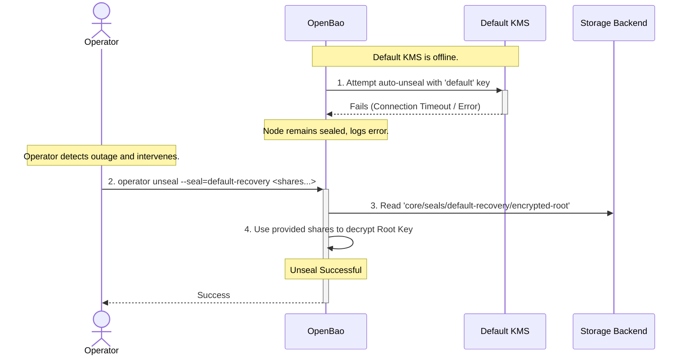
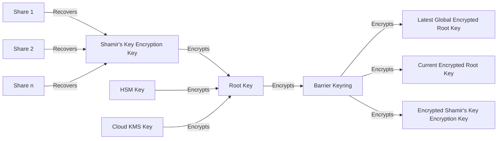
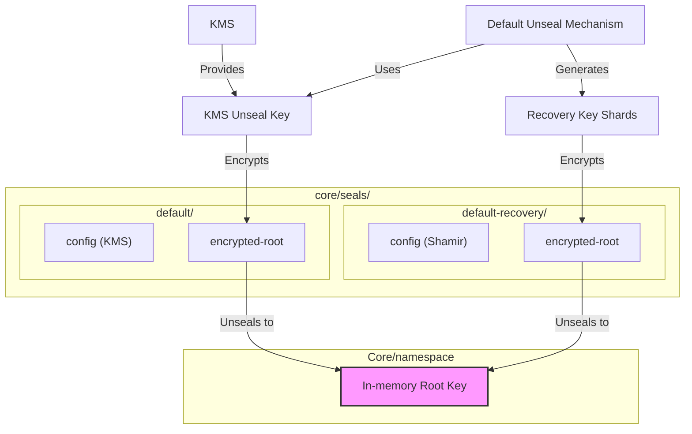
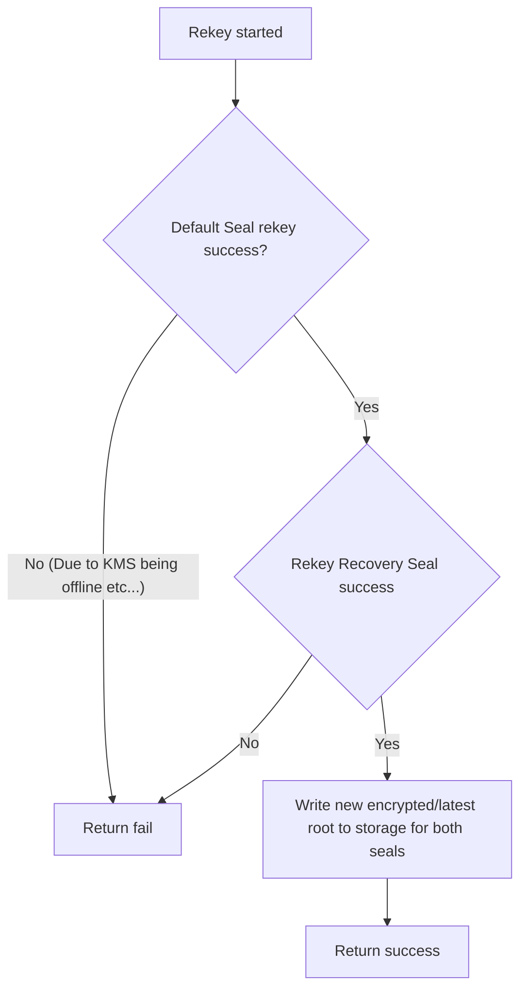

# Recovery Seal

## Summary

When an OpenBao instance is initialized with an auto-seal method configured, a
recovery key in the form of Shamir's shared secrets is generated. This recovery
key, however, cannot currently be used to unseal an OpenBao instance or
namespace.

This RFC proposes a mechanism to allow these recovery keys to be used
as unseal keys. This allows an operator to use them in break-glass recovery
scenarios, as follows:



## Problem Statement

The recovery key generated for an auto-unseal mechanism currently cannot be used
for unsealing a sealed OpenBao instance or namespace. This poses a significant
risk of data inaccessibility if the auto-seal mechanism becomes unusable due to
factors outside of an operator's control (e.g., a KMS going offline, an HSM
failure). A "break-glass" recovery path is highly desirable in this case, where
the operator can use the recovery key to unseal an OpenBao instance or
namespace, allowing them to recover access to the data.

The Parallel Unseal RFC already covers this break-glass use case with a system
designed for unseal resiliency. However, its implementation is a significant
undertaking, primarily due to the complex logic required to allow offline seals
to catch up after a root key rotation. This proposal outlines an approach to
partly achieve that vision. We will deliver the most critical "break-glass"
recovery feature first, deferring the more complex components. Once Parallel
Unseal lands, this proposed feature can still be available to complement it.

## User-facing description

### Recovery seal

An optional config `enable_recovery_seal` will be added to the seal stanza to
allow users to opt in to using recovery seal, for example:

```hcl
seal "hsm" {
  name = "default"
  enable_recovery_seal = true
  ...
}
```

If `enable_recovery_seal` is set to `true`, a recovery seal will be created
during generation of the auto seal's recovery key. This recovery seal will be
named `<seal name>-recovery`. For example, if the auto seal is named `default`,
its recovery seal will be named `default-recovery`. To prevent naming conflicts,
OpenBao will prohibit manually configured seals from using the `-recovery`
suffix, returning an error if a seal is configured with such a name.

Since the recovery seal uses the key material from the recovery key, a rotation
of the recovery key will also rotate the Shamir's key shards of the recovery
seal and issue new shares.

### Unsealing with recovery key

If the OpenBao instance or namespace cannot be unsealed using its auto unseal
mechanism, the operator can unseal using the recovery seal by specifying the
recovery seal name. This functions similarly to unsealing using a standard
Shamir's seal.

`bao unseal --seal=default-recovery <share>`

## Technical Description

### Storage

The following storage layout proposed by Parallel Unseal is followed by this
proposal. This allows for forward compatibility with Parallel Unseal while also
enabling us to have multiple paths to the root key.



The following diagram describes a sample storage setup with recovery seal in place.



Using the generated recovery key as unseal key, the recovery seal is stored in
storage as a separate, fully-formed Shamir's seal configuration. This means the
recovery key can be used to decrypt the encrypted root key, effectively
unsealing the OpenBao node/namespace.

### Rekeying (Root key rotation)

The Parallel Unseal RFC has a mechanism for offline seal configurations to catch
up when a root key rotation has occurred even after multiple root key or key
ring rotations. In this proposal, we will enforce an operational constraint to
simplify the implementation: the root key rotation operation will be blocked if
the primary auto-seal is offline. This constraint ensures that the root key for
every seal is always consistent, eliminating the need for a catch-up mechanism.



### Barrier key rotation

Since barrier key rotation doesn't require the seal mechanism to be online,
rotation is always allowed.

### API & CLI changes

`POST sys/unseal` will have a new optional parameter `seal` to specify the seal

```
{
  "key": "abcd1234..."
  "seal": "default-recovery"
}
```

Similarly, `bao unseal` will have an optional `--seal` parameter

```
bao unseal --seal=default-recovery abcd1234...
```

## Rationale and Alternatives

While the use case is already covered by Parallel Unseal, the design proposed
in this RFC can be implemented at a lower complexity and effort, helping us
support the break-glass recovery scenario faster.

Once Parallel Unseal is implemented, this feature is designed to complement it.
The usage of the recovery key as a recovery path for auto seals can be more
intuitive for the user. Furthermore, it can address one usability gap identified
by the Parallel Unseal RFC:

> One notable limitation is that existing recovery keys will be unable to
> function as backup Shamir's unseal keys. This is because the keyshares do not
> combine to form a copy of the root key encrypting the barrier keyring and
> instead form an alternative recovery object

### Alternative: Two Seal Stanzas

One alternative to this proposal would be to allow users to manually define a
secondary Shamir's seal in their configuration to serve as a recovery mechanism
like follows

```hcl
seal "hsm" {
  name = "default"
  ...
}

seal "shamir" {
  name = "recovery"
  ...
}
```

The same storage structure and operation constraint (Root key rotation not
allowed if auto seal is offline) still apply here. The notable difference is
that since the recovery Shamir's seal is explicitly defined as its own seal
configuration, this seal will have its own unseal key material, and not use the
recovery key from the auto seal.

This approach has some advantages:
* Still requires less effort to implement than Parallel Unseal, so we can
  quickly support the "break-glass" recovery use case.
* The explicit seal configuration is completely compatible with the design from
  Parallel Unseal. When Parallel Unseal lands, the recovery seal will
  automatically become one of the parallel seals without an explicit upgrade.

and some downsides:
* Recovery keys still cannot be used to unseal, which may be unintuitive to some users.
* New key materials have to be generated to be used as unseal key.

## Downsides

1. Introduces a "Special" Seal Type: This feature creates a tightly coupled
   relationship between an auto-seal and its recovery seal. This concept of a
   "linked" seal is a special case that diverges from the purer model of fully
   independent seals envisioned in the full Parallel Unseal RFC, adding a small
   amount of logical complexity to the codebase.

2. Increased operator cognitive load: operators must now be aware of the
   `<seal name>-recovery` concept and the need to use the `--seal` flag during a
   break-glass scenario. This adds a small amount of cognitive load compared to
   a single-seal setup.

3. Possible Redundancy when Parallel Unseal is implemented.

## Security Implications
Similar to Parallel Unseal, adding another path to unseal the instance widens
the attack surface. The compromise of a single seal could lead to the compromise
of the entire OpenBao instance or namespace protected by it.

This represents the trade-off of this feature: an improvement in operational
resilience at the cost of an increase in the attack surface.

## User/Developer Experience

The primary experience improvement is for operators during an outage. They can
now use an auto-seal's recovery keys to unseal the instance via the recovery
seal, which is an intuitive "break-glass" procedure.

Operators can opt in to create recovery seal by specifying
`enable_recovery_seal = true` in their seal configuration.

The manual unseal process is largely unchanged but will require specifying the
seal name with the `--seal` flag on the CLI or the `seal` parameter in the API.

## Unresolved Questions

## Related Issues
- https://github.com/openbao/openbao/issues/299
- https://github.com/openbao/openbao/issues/888

## Proof of Concept
tbd
