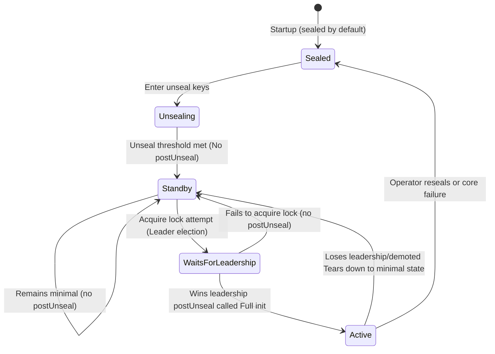

# Standby Nodes Handle Read Requests

### Summary

This RFC proposes enhancing standby nodes in HA setup to handle read requests directly, eliminating the current bottleneck where all requests must be processed by the single active leader node. This represents the first step toward horizontal read scalability in OpenBao.

**Key Approach**: Simplify the architecture by making **all standby nodes capable of serving read requests by default**, rather than maintaining separate **performance standby** vs **regular standby** node types. This unified approach reduces complexity while providing horizontal read scaling.

### Problem Statement

### Current Architecture Limitation

OpenBao currently operates with a strict active-passive HA model:
- **Active Node**: Handles all read and write requests.
- **Standby Nodes**: Forward all requests to the active node.


Following a successful `unseal`, a **standby node’s** primary responsibility is to maintain a fully **consistent replica** of the **active node’s** state by continuously applying the active node’s *write-ahead log* in near real-time. This guarantees up-to-date data replication and enables a rapid Recovery Time Objective (RTO) in the event of failover. However, this architecture results in pronounced **resource underutilization**. While the system continually invests in I/O operations for persistent storage and consumes network bandwidth to synchronize all state changes, the standby node’s compute resources remain largely idle. There is a clear opportunity to enhance overall cluster efficiency by allowing standby nodes to perform read requests.

### User-facing description

### The Unified Standby Approach

Instead of introducing complexity with separate node types, this RFC proposes **making all standby nodes capable of serving read requests by default**. This approach:

- **Eliminates Artificial Distinctions**: No need for "performance standby" vs "regular standby" concepts
- **Simplifies Operations**: All standby nodes behave consistently
- **Reduces Configuration Complexity**: No need for separate flags or node type management
- **Leverages Existing Infrastructure**: Uses current HA mechanisms with minimal changes

### Business Impact

- **Horizontal Read Scaling**: Distribute read load across all standby nodes
- **Simplified Architecture**: Single node type (active/standby) instead of multiple types
- **Better Resource Utilization**: All standby nodes contribute to serving traffic
- **Reduced Operational Complexity**: No need to manage different standby types

### Non-Goals

- Write operation scaling
- Cross-cluster replication
- Maintaining separate "performance standby" node types

### Technical Description

### Core Components Involved

1. **`vault/ha.go`**: Manages standby state and leader election
2. **`vault/core.go`**: postUnseal is invoked on the active node, and performance standby nodes.
3. **`http/handler.go`**: Contains `handleRequestForwarding()` middleware
4. **`vault/request_handling.go`**: Core request processing logic
5. **`sdk/framework/backend.go`**: Plugin-level forwarding decisions

**Single Leader Model**:
`vault/ha.go` establishes a single-leader architecture. Functions like `Core.Leader` and `Core.LeaderLocked` are responsible for identifying the current leader.
Standby nodes (managed by `runStandby()` and `waitForLeadership()` in `vault/ha.go`) periodically check for leader changes and attempt to acquire a distributed lock (`acquireLock()`) to become the new leader if the current one fails.
All write operations are directed to this single leader. If a request arrives at a standby node, `vault/ha.go`'s logic will redirect it to the active leader.
In `vault/ha.go`: Functions `Core.Standby()` and `Core.StandbyStates()` return if core is in standby mode and what is a state of standby node.

---

---

**PostUnseal Implementation**:
The key difference between standby and active nodes is the `postUnseal` process. Currently:
- **Standby Nodes**: Do NOT call `postUnseal`, maintaining minimal state - only enough for leader election and basic health checks
- **Active Node**: Calls `postUnseal` for full initialization - mount tables, plugins, policies, token stores, etc.

For standby nodes to serve read requests effectively, they should perform **postUnseal** - exactly the same initialization as the leader. This approach provides:

- All components initialized and ready
- No additional setup needed when becoming leader

**PostUnseal for enchanced Standby Nodes**
Needs modification:
```
func (c *Core) unsealInternal(ctx context.Context, rootKey []byte) error {
...
	// Do post-unseal setup if HA is not enabled
	if c.ha == nil {
           c.setupCluster(ctx)
           c.migrateSeal(ctx)
           c.postUnseal(ctx, ctxCancel, standardUnsealStrategy{});
           // Force a cache bust here, which will also run migration code
	   if c.seal.RecoveryKeySupported() {
		c.seal.SetRecoveryConfig(ctx, nil)
           }

	   c.standby = false
         } else {
	   // Go to standby mode, wait until we are active to unseal
	   c.standbyDoneCh = make(chan struct{})
	   c.manualStepDownCh = make(chan struct{}, 1)
	   c.standbyStopCh.Store(make(chan struct{}))
	   go c.runStandby(c.standbyDoneCh, c.manualStepDownCh, c.standbyStopCh.Load().(chan struct{}))
	}
...
}
```

Function - `Core.runStandby` starts `Core.waitForLeadership` - Attemp post-unseal process in case of promoting to Leader.

The storage write protection mechanism ensures that any attempt to write from standby nodes gets blocked at the storage layer and properly forwarded to the leader - return `ErrReadOnly` -> `ErrStandbyPleaseForward`.

**Raft Log (WAL) and Replication**:
The `physical/raft/raft.go` file defines the RaftBackend, which is the concrete implementation of the `physical.Backend` interface when Raft is used as the storage.
When a write operation (e.g., Put, Delete) is initiated on the leader, it's first encapsulated as a `physical.StorageEntry` and then passed to the Raft library's `Apply()` method (within `physical/raft/raft.go`).
The Raft library then appends this operation as a new entry to its Write-Ahead Log (WAL).
This log entry is then replicated to all follower nodes in the Raft cluster. Consensus is achieved when a majority of nodes have successfully written the log entry to their local, durable storage.

This replication mechanism is designed for high availability (HA) and read scaling within a single cluster.

**State Machine Application (FSM)**:
The `physical/raft/fsm.go` file defines the `fsm` struct, which implements the `raft.FSM` interface. This serves as the state machine that Raft keeps consistent across all nodes.
After a log entry is committed by the Raft cluster (when a quorum has acknowledged it), the `fsm.Apply(log *raft.Log)` method runs on every node, both leader and followers.
Inside `fsm.Apply(log *raft.Log)`, the `log.Data` (which contains a `physical.StorageEntry`) is decoded. The actual operation (such as Put or Delete) is then performed on the local storage backend. This process ensures all nodes apply the same changes in the same order, keeping the state consistent.
The methods `fsm.Snapshot()` and `fsm.Restore()` manage state snapshots. Snapshots help with log compaction and allow new or lagging nodes to catch up without replaying the entire log history.
  - `logical.ErrStandbyPleaseForward` - For forwarding requests to leader
  - **Remove**: `logical.ErrPerfStandbyPleaseForward` (no longer needed with unified approach)
- **Forwarding Logic**:
  - Mature RPC-based request forwarding in `http/handler.go`
  - Can be simplified by removing performance standby special cases
- **State Management**:
  - `core.Standby()`, `core.StandbyStates()` for node state tracking
  - **Simplify**: Remove `core.PerfStandby()` complexity
- **Configuration**:
  - **Remove**: `disable_performance_standby` (no longer relevant)


Any request received by a non-active node is forwarded to the active node. This is managed by `handleRequestForwarding` middleware in `http/handler.go`, which checks if the node is the leader and forwards the request if it is not.

**Enhanced Forwarding Logic**:
Forwarding should depend on the error message returned from invoking the request. On standby nodes, a storage shim will ensure that the underlying storage is not written to, instead returning `logical.ErrReadOnly`. When a storage write occurs, this middleware will not return the error to the caller but instead invoke request forwarding.

`ErrStandbyPleaseForward` should be returned in `request_handling.go` in places like `Core.CheckToken`, `Core.handleCancelableRequest`, `handleLoginRequest`, `PopulateTokenEntry`, and `Core.checkSSCTokenInternal` to forward requests as early as possible.


### Rationale and alternatives

It's a first step to Horizontal Scalability.
Impact:
- Improvement of read throughput
- Simplified Architecture - remove artificial node type distinctions.

Without horizontal read scaling, large organizations will continue hitting single-node performance ceilings, forcing expensive vertical scaling or complex external caching solutions.

### Downsides

- We lose some fine-grained control over which nodes serve reads
- We won't be able to detect all requests that will write to the storage in the middleware
- The enhanced `postUnseal` for standby nodes will increase memory and CPU usage as they maintain more active state compared to traditional passive standbys.


### Security Implications

- We can certainly improve availability
- Potential Problems with data integrity between nodes.

### User/Developer Experience

- Improved read performance and latency for end users
- Simplified operational model - no need to manage different standby types
- The current recommendation is a maximum of 3 nodes, but this should no longer be the case
- Plugin developers need to be aware that read operations might run on standby nodes
- Existing plugins work without modification using the `ForwardPerformanceStandby` flags

### Unresolved Questions

- Should we execute postUnseal on standby nodes or partial postUnseal (setup read only components)?
- Cache invalidation strategy for maintaining consistency across nodes
- Staleness detection and acceptable lag windows for different use cases

### Related Issues

- https://github.com/openbao/openbao/issues/1462
- https://github.com/openbao/openbao/issues/38
- https://github.com/openbao/openbao/issues/569

- https://openbao.org/blog/vision-for-namespaces/

### Proof of Concept / Related PRs

- [Unseal standby nodes #1592](https://github.com/openbao/openbao/pull/1592)
- [Implement cache invalidation for namespaces and policies #1551](https://github.com/openbao/openbao/pull/1551)
- [Implement change notification for raft storage backend #1552](https://github.com/openbao/openbao/pull/1552)
- [Implement cache invalidation for quotas #1584](https://github.com/openbao/openbao/pull/1584)
- [Implement cache invalidation for physical.Cache #1566](https://github.com/openbao/openbao/pull/1566)
- [Implement cache invalidation for plugins #1564](https://github.com/openbao/openbao/pull/1564)
- [Implement cache invalidation for audits #1596](https://github.com/openbao/openbao/pull/1596)
